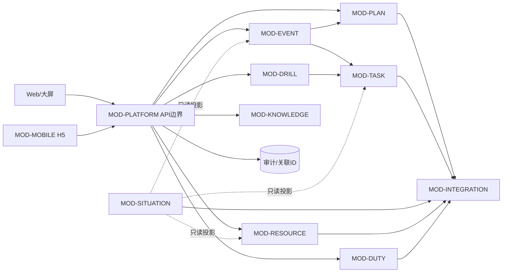

# G3-01 设计输入基线、模块边界与架构决策候选

- Task ID：G3-01R（继承 G3-01 历史）
- 主责：B（用户授权 AI 代理执行）
- 复核：A（可交付性与计划接口）、C（需求符合性与边界）
- 版本：V0.2
- 日期：2026-09-17
- 状态：SELF_CHECKED / REVIEW
- 用途：G3-02 工程计划及 G3-03—G3-07 设计工作的受控输入，不是概要设计、详细设计、数据库设计、接口契约或已批准 ADR。

## 1. 基线目的与准入结论

本基线固定第三关设计必须继承的需求、验收条件、非功能约束和责任边界，并把系统划分为可独立设计、实现和验证的模块。架构部分只提供可比较的候选及 B 的技术建议，最终选择必须由 A、B、C 人工评审后写入 ADR；候选分数不等于批准。

G3-00 已完成，第二关 M2 的需求与规格双镜像已通过：39 条 G2-FR 连续唯一、34 条★FR 未降级、每条 FR 有 3 条 AC，共 117 条。当前 RTM 的设计和测试列仍为预留状态，因此第三关必须建立“G2-FR → AC → 设计元素 → OpenAPI/数据对象 → 测试用例 → 结果证据”双向链。

## 2. 受控设计输入

| 输入 ID | 受控来源 | 设计约束 | 当前状态 |
| --- | --- | --- | --- |
| IN-G3-01-01 | 原始《用户需求书》 | 项目事实、39 条 FR、34 条★FR、PE-01—PE-12、接口、部署、验收和责任边界的最高业务来源 | FROZEN / 不修改 |
| IN-G3-01-02 | `control/baselines/BASELINE-V1.0.md` | 继承 12 项澄清、关键数字及甲乙责任；冻结后变更须走 Issue/Change | FROZEN |
| IN-G3-01-03 | `control/g2/requirements_catalog.md` | G2-FR-001—029 为 MVP Must；030—039 非 MVP但仍属本期范围；全部必须进入设计与测试 | DONE |
| IN-G3-01-04 | `docs/work/A_PM/software_requirements_specification_v0.1.md` | 业务语义、外部接口、数据、安全、部署及验收约束 | M2 PASS |
| IN-G3-01-05 | `docs/work/B_TECH/spec.md` | 117 条 Given/When/Then AC；后续原子任务和测试必须引用具体 AC | M2 PASS |
| IN-G3-01-06 | `docs/work/C_REQ/rtm_v1.md` | 设计挂接与测试挂接入口；不得把 PENDING_EVIDENCE 写成已验证 | M2 PASS / DES-TC 待填 |
| IN-G3-01-07 | `docs/work/A_PM/g2_m2_review_pack.md` | M2 只证明需求与规格一致，不证明接口、实现、性能或安全 | PASS_WITH_BOUNDARY |
| IN-G3-01-08 | G2-P04/P05 原型走查 | 仅用于理解页面、交互和演示状态；localStorage、Mock、前端组件不构成正式架构或数据模型 | REFERENCE_ONLY |
| IN-G3-01-09 | 第三关任务书 | 四件套设计文档、OpenAPI、ADR≥2、非功能设计、RTM、测试左移、原子任务和工程基线要求 | ACTIVE |
| IN-G3-01-10 | `control/facts.md`、`key_numbers.md`、`issues.md` | 控制数字、接口/数据责任和开放问题；候选设计不得扩大承诺 | CONTROLLED |

明确标注为课程课件的 `ch1.3 Project使用.pdf` 和“第 5 章 5.2 项目组织与管理1.pptx”只登记，不读取、不作为项目事实或架构裁决依据。教学 ADR 样例只可供后续参考结构，不得复制其项目技术栈或结论。

## 3. 不可弱化的设计约束

### 3.1 功能与追踪

1. 39 条 FR 全部进入设计，不能因原型只展示 P1—P5 或 10 条非 MVP 优先级较低而删除。
2. 34 条★FR不得负偏离；G2-FR-007 为 MVP 非★，G2-FR-030/032/033/038 为非 MVP 非★，其余属性按受控目录。
3. 每个设计模块必须声明主责数据、公开服务、依赖端口、错误/降级和对应 G2-FR/AC；G3-08 再把稳定设计 ID 挂入 RTM。
4. 关键业务写入先形成可恢复业务状态，再派生通知、外部调用和统计投影；不得用消息发送成功代替业务提交成功。

### 3.2 性能、容量、可靠性与安全

| 约束组 | 设计输入 | 设计阶段必须产出的保障机制 |
| --- | --- | --- |
| 事件时效 | 预案启动下发≤3秒；告警接入≤2秒；确认到任务下达≤3分钟 | 统一计时点、异步派发、幂等、队列延迟指标、端到端追踪 |
| 外部展示 | 定位刷新≤2秒且不降源精度；视频首帧≤3秒；安防≤30秒；统计≤60秒 | 新鲜度、源/接收/展示时间戳、超时、缓存上限和降级标识 |
| 通用性能 | 95%页面请求≤3秒；地图≤2秒；扫码≤1秒；报表≤5秒 | 性能预算、读模型/索引、压测场景和监控指标 |
| 容量 | 峰值≥100人、事件/任务≥10年与≥2万/20万、站点≥30、物资≥1000、人员≥300、打卡≥3年 | 数据分区/归档评估、索引、连接池、容量模型和增长验证 |
| 可用恢复 | 7×24、试运行可用率≥99.5%、单点故障 MTTR≤2小时 | 健康检查、故障隔离、持久化恢复、备份恢复演练和告警 |
| 安全 | 应用侧不低于等保二级相关条款；高危漏洞0；审计日志≥180天；核心单测≥70% | 统一认证授权、数据权限、审计、防篡改、SCA/扫描/渗透门禁 |
| 部署 | 私有化容器部署；第三方在干净环境一次成功且≤2小时 | 离线制品、配置外置、初始化/升级/回滚、部署与恢复脚本 |

KN-070—078 仅是上一阶段的方案建议，不能作为甲方既定配置或已验证能力；是否采纳须经容量、兼容、存储、网络和恢复验证。

### 3.3 甲乙责任与集成边界

| 外部能力 | 甲方/既有平台责任 | 本系统责任 | 设计禁区 |
| --- | --- | --- | --- |
| 统一中台 | 身份、组织、权限、消息、工作流、文件、门户、汇聚及账号环境 | 应急业务适配、权限传递、失败处理、审计 | 不重建通用中台能力 |
| 视频平台 | GB/T 28181 能力、通道、录像及≥30天保存 | 实时调阅、检索回放、授权、超时和错误处理 | 不新建录像存储，不承诺源端能力 |
| 定位系统 | 基础设施、标识、坐标/楼层及亚米级源数据 | 关联、映射、新鲜度、≤2秒刷新和不降精度 | 不建设定位基站，不推断过期位置 |
| 消息平台 | 通道、账号、签名、配额、回执及验收环境 | 并发、重试、回执、留痕和人工降级 | 不自建短信平台，不以 Mock 证明到达率 |
| 地图服务 | 合法二维、楼层和验收所需三维地图/服务 | 加载、叠加、拾取、点位和坐标适配 | 不重新测绘或三维建模 |
| 信息发布系统 | 既有发布平台/终端、接口协议、授权、发布通道及回执 | 应急/疏散信息编排，授权确认后下发，跟踪受理/发布回执，失败告警并人工降级 | 不自建信息发布平台，不把受理或 Mock 当作实际发布成功 |
| 入侵报警系统 | 既有入侵探测设备、报警主机/平台、点位编码、接口协议及测试告警 | 接收并校验入侵告警，去重、关联点位、按规则转事件并审计 | 不改造入侵设备，不把未知/重复告警静默当成功 |
| 门禁系统 | 既有门禁终端、协议、授权、安全联锁及回执 | 授权后二次确认、单次下发、结果对账、失败告警和人工降级 | 不绕过联锁，不自动重放控制指令 |
| 消防系统 | 既有火灾报警/消防设备平台、点位与状态编码、接口协议及测试环境 | 接收火警/设备状态，校验、去重、关联点位、按规则转事件并记录故障状态 | 不控制需求外消防设备，不把接口故障当作无告警 |
| IoT/客流 | 告警/客流接口、字段、账号和环境 | 校验、去重、转事件、有限重试、补传与审计 | 不把外部失败静默当成功 |
| H5 宿主 | 智慧管理 APP、签名和发布 | H5 包及认证、扫码、拍照、上传等宿主适配 | 不另交付原生 Android/iOS APP |
| 基础资源 | 服务器、网络、证书、备份介质、后备电源 | 最低配置、容器制品、部署和恢复方案 | 不把建议配置写成甲方采购义务 |
| 基础业务数据 | 提供源数据并确认业务正确性 | 模板、映射、清洗、导入和技术校验 | 不单方保证源数据业务真实性 |

### 3.4 KN-064 四系统端到端联动验收挂接

KN-064 要求在目标环境对视频、信息发布、物联网、统一中台四系统进行端到端联动验收，不表示当前已连通或已验收。

| 系统/端口 | 必须验证的联动 | 证据 |
| --- | --- | --- |
| 视频 / EXT-VIDEO | 事件关联摄像机、授权实时调阅、历史回放、超时/无录像错误 | 通道清单、请求响应、首帧计时、回放及失败日志 |
| 信息发布 / EXT-PUBLISH | 授权确认内容与范围、下发、受理/发布回执、失败转人工 | 内容摘要、授权、请求回执及人工处置记录 |
| 物联网 / EXT-IOT | 告警校验、去重、转事件、有限重试与补传 | 字段、测试告警、重试补传及事件关联 ID |
| 统一中台 / EXT-MIDDLE | 身份、组织、权限一致，工作流、文件、消息、门户/汇聚适配及降级 | 账号权限样例、调用审计和异常记录 |

联合场景必须用同一 `traceId/eventId` 串联“物联网告警转事件 → 中台身份/权限与流程 → 视频调阅 → 授权信息发布 → 回执/失败降级与审计”。四系统均验证正常、无权、超时/失败；Mock、占位页和单接口检查不能替代 KN-064 端到端证据。
## 4. 逻辑模块边界

模块 ID 在 G3-03—G3-08 中保持稳定。模块表示领域和责任边界，不预先等同独立进程或微服务。

| 模块 ID | 模块 | 主责能力与主责数据 | 主覆盖 G2-FR | 对外依赖 |
| --- | --- | --- | --- | --- |
| MOD-PLAN | 预案与业务配置 | 预案/版本、流程模板、任务模板、预案附件、预案类型 | 001—003、030、033 | 中台工作流、文件 |
| MOD-EVENT | 事件与核实处置 | 事件、续报、核实审批、启动记录、关闭材料、调查与报告、事件类型 | 013—016、034、037 | MOD-PLAN、MOD-TASK、IoT |
| MOD-TASK | 处置任务与消息编排 | 任务快照、领取/反馈/催办/完成、派发命令、消息回执和补偿 | 003、015、020、022 | 统一消息、中台组织权限 |
| MOD-SITUATION | 指挥态势与统计 | 事件时间线读模型、位置/视频/站点投影、安防与统计视图 | 004—007、026、039 | 地图、定位、视频、安防 |
| MOD-RESOURCE | 人员与物资 | 应急人员/小组、物资站点/台账、有效期、盘点计划/快照/差异 | 007—009、025、031、035 | 地图、中台组织、文件 |
| MOD-DUTY | 值班与打卡 | 值班计划、打卡组/点/时段/二维码、打卡记录、异常告警和统计 | 017—020、024、032 | 地图、消息、宿主扫码 |
| MOD-DRILL | 演练与评估 | 演练计划/任务/执行、评估模板版本、整改与补演 | 010—012、023、036 | MOD-TASK、消息、文件 |
| MOD-KNOWLEDGE | 知识与检索 | 事件知识沉淀、知识条目、分类、发布与授权检索 | 016、038 | 中台文件、权限 |
| MOD-MOBILE | H5 业务接入 | H5 会话与宿主能力适配；调用事件、任务、演练、打卡、盘点和知识服务 | 021—025、038 | 宿主 APP、中台认证 |
| MOD-INTEGRATION | 外部系统适配 | 视频、信息发布、入侵、门禁、消防、IoT/客流、中台、消息、定位、地图适配器及调用审计 | 005、006、020、026—029；F-005、F-208、KN-064 | 全部甲方既有系统 |
| MOD-PLATFORM | 应用公共技术能力 | API 网关边界、关联 ID、审计、配置、健康检查、幂等、错误语义 | 横切 001—039 | 中台身份权限/文件 |

### 4.1 边界规则

1. Web、H5 和大屏只通过统一应用 API 调用业务模块，不直接访问数据库或外部系统。
2. 每个领域对象只有一个写入主责模块；其他模块通过公开服务或事件读取，不跨模块直接修改表。
3. MOD-INTEGRATION 以 EXT-VIDEO、EXT-PUBLISH、EXT-INTRUSION、EXT-ACCESS、EXT-FIRE、EXT-IOT、EXT-MIDDLE 等逻辑端口隔离厂商协议；不得包含事件核实、任务状态、发布授权或门禁授权等业务决策。
4. MOD-TASK 管理业务任务与派发状态；统一消息平台只传送消息，回执不能直接改写事件最终状态。
5. MOD-SITUATION 使用可重建的读模型，不成为事件、人员、物资或任务事实源。
6. MOD-MOBILE 是渠道适配边界，业务校验仍由对应领域模块执行，避免 Web/H5 形成两套规则。
7. 控制类调用不自动重放；可重试调用必须带业务幂等键、有限次数、退避、死信/人工清单与审计。
8. 领域间先采用进程内契约或稳定 API/事件接口；是否拆进程由 ADR 与性能/故障证据决定。

### 4.2 核心依赖方向

该图是逻辑依赖。G3-03 才确定部署单元；G3-04 才确定概念、逻辑和物理数据模型；G3-06 才形成接口/OpenAPI 契约。

### 4.3 外部适配端口清单

| 端口 | 独立适配归属 | 回指 | 当前状态 |
| --- | --- | --- | --- |
| EXT-VIDEO | 既有视频平台 | F-005、F-208、G2-FR-006/029、KN-064 | PENDING_INTERFACE_VALIDATION |
| EXT-PUBLISH | 既有信息发布系统 | F-005、F-208、KN-064 | PENDING_INTERFACE_VALIDATION |
| EXT-INTRUSION | 既有入侵报警系统 | F-005、F-208；经 IoT 总线时关联 G2-FR-027 | PENDING_INTERFACE_VALIDATION |
| EXT-ACCESS | 既有门禁系统 | F-005、F-208、G2-FR-029 | PENDING_INTERFACE_VALIDATION |
| EXT-FIRE | 既有消防系统 | F-005、F-208；经 IoT 总线时关联 G2-FR-027 | PENDING_INTERFACE_VALIDATION |
| EXT-IOT | 既有物联网/客流平台 | F-005、F-208、G2-FR-027、KN-064 | PENDING_INTERFACE_VALIDATION |
| EXT-MIDDLE | 统一中台 | F-005、F-208、G2-FR-028、KN-064 | PENDING_INTERFACE_VALIDATION |
| EXT-MESSAGE | 统一消息/短信平台 | F-005、F-208、G2-FR-020/022 | PENDING_INTERFACE_VALIDATION |

入侵、门禁、消防必须保留三个独立逻辑端口。即使甲方最终通过同一安防/IoT 网关提供，G3-06 也只能在物理连接层复用通道；数据语义、权限、错误码、降级和验收证据仍分别定义。
## 5. 架构候选比较

### 5.1 评价准则

采用 1—5 分（5 最优），权重总计 100。评分用于暴露取舍：需求/边界契合20、数据一致性20、性能容量15、故障隔离15、私有部署运维15、演进扩展10、可测试追踪5。

| 候选 | 需求/边界 20 | 一致性 20 | 性能 15 | 隔离 15 | 部署运维 15 | 演进 10 | 测试 5 | 加权总分/100 |
| --- | ---: | ---: | ---: | ---: | ---: | ---: | ---: | ---: |
| ARC-A 模块化单体 + 端口适配 + 异步任务 | 5 | 5 | 4 | 3 | 5 | 4 | 5 | 89 |
| ARC-B 领域微服务 + 事件驱动 | 4 | 3 | 5 | 5 | 2 | 5 | 3 | 77 |
| ARC-C 统一中台工作流主导 + 轻业务适配 | 3 | 3 | 3 | 2 | 4 | 3 | 3 | 60 |

### 5.2 ARC-A：模块化单体 + 端口适配 + 异步任务

- 机制：核心领域在少量应用部署单元内按模块强隔离；外部系统走端口/适配器；通知、投影、报表等通过持久化异步任务解耦。
- 优点：事务边界清楚，适合当前规模和私有部署；能在不复制中台能力的前提下隔离外部协议；第三方两小时部署和故障定位较可控。
- 风险：进程级隔离较弱；若模块依赖纪律失守，会退化为耦合单体。
- 约束：必须建立模块依赖检查、数据所有权、Outbox/任务表、幂等与可观测性；热点适配器可在证据支持时独立部署。
- B 建议：作为首选候选进入 ADR，但须经 A/C 复核及人工拍板。

### 5.3 ARC-B：领域微服务 + 事件驱动

- 机制：事件、任务、资源、演练、适配等拆为独立服务，通过 API 和事件总线协作。
- 优点：故障隔离和独立扩展较强，适合外部接入波动和态势读模型。
- 风险：当前峰值与业务规模不足以自动证明拆分收益；分布式事务、消息一致性、部署、监控、测试环境和两小时独立部署复杂度明显增加。
- 采用条件：甲方基础环境提供成熟编排、消息和可观测平台；团队具备运维能力；压测或故障模型证明需要独立扩缩/隔离。

### 5.4 ARC-C：中台工作流主导 + 轻业务适配

- 机制：尽量用甲方工作流、文件、消息和门户编排业务，本系统保留薄业务层。
- 优点：复用既有能力，通用功能建设少。
- 风险：事件/任务/盘点/打卡等领域状态和秒级链路可能受中台能力约束；甲方接口细节尚未证明足以承载全部业务；容易把应急业务规则散落到配置。
- 采用条件：中台提供可验证的事务、版本、审计、性能、离线/降级和可移植能力，并能满足全部相关 AC；否则只作为通用能力依赖，不作为业务核心架构。

## 6. 待形成 ADR 的架构决策候选

| 决策 ID | 决策主题 | 候选 | B 建议 | 决策所需证据 | 状态 |
| --- | --- | --- | --- | --- | --- |
| ADC-001 | 应用拆分粒度 | 模块化单体 / 领域微服务 / 中台工作流主导 | ARC-A | 部署资源、团队运维能力、峰值压测、故障域与两小时部署演练 | HUMAN_DECISION_REQUIRED |
| ADC-002 | 业务提交与异步副作用一致性 | 事务 Outbox/持久任务 / 分布式事务 / 尽力发送 | 事务 Outbox/持久任务 | 重复启动、消息失败、重启恢复和回执乱序测试 | HUMAN_DECISION_REQUIRED |
| ADC-003 | 态势读模型 | 同库独立读模型 / 独立查询库或索引 / 直接联查业务表 | 先同库独立读模型，保留迁移接口 | 地图/态势/报表数据量、刷新和 P95 压测 | HUMAN_DECISION_REQUIRED |
| ADC-004 | 私有化编排 | Docker Compose 或等价轻编排 / Kubernetes | 先以满足两小时部署的轻编排为候选 | 甲方环境、节点规模、高可用要求、离线交付与运维能力 | HUMAN_DECISION_REQUIRED |
| ADC-005 | 外部接口隔离 | 应用内适配器 / 独立接入服务 | 默认应用内端口适配，视频/IoT等按故障与容量证据拆分 | 厂商 SDK/协议、资源占用、崩溃风险、升级频率 | HUMAN_DECISION_REQUIRED |
| ADC-006 | 流程实现 | 领域状态机 / 中台工作流 / 混合 | 事件/任务用领域状态机，审批类评估中台工作流适配 | 中台流程 API、版本/超时/审计与性能验证 | HUMAN_DECISION_REQUIRED |

G3-07 至少应将 ADC-001、ADC-002 写成正式 ADR，并记录选定方案、被否决方案、证据和后果。若证据不足，ADR 状态应保持 Proposed，不能伪装为 Accepted。

## 7. 接口与数据设计前置规则

### 7.1 接口规则

- 统一采用版本化 REST API 与 OpenAPI 3.0 契约；事件回调另行定义签名、重放保护、顺序和幂等。
- 统一错误结构至少包含 `code`、`message`、`traceId`、可重试标识和必要字段错误；HTTP 状态与业务错误不能互相替代。
- 写操作使用业务幂等键；门禁等控制动作必须二次确认、单次下发、回执对账，不允许盲目自动重试。
- 外部调用记录关联 ID、请求时间、响应时间、结果、尝试次数和脱敏摘要，不记录明文凭据。
- 文件上传由中台文件能力承载，业务模块保存受控引用、版本、权限和校验结果。

### 7.2 数据规则

- 后续概念模型至少包含：预案/版本、流程/任务模板、事件/续报、处置任务、关闭材料、人员/组织、位置快照、物资站点/台账、盘点计划/快照/差异、值班/打卡、演练/评估、知识、消息回执、外部调用和审计。
- 主键、外部标识和业务编号分离；跨系统保留映射，所有时间至少区分业务发生、源产生、系统接收和处理时间。
- 状态迁移使用显式合法路径及版本号/乐观锁；历史引用保存当时版本或快照。
- 统计与态势投影可重建；不得反向成为业务事实源。
- 保存周期、归档、备份和恢复须落实 KN-021、026、029、030 及 F-201，不把视频录像纳入本系统存储容量。

## 8. 待决策项、风险和阻断关系

| 项目 | 影响 | 当前处置 | 阻断关系 |
| --- | --- | --- | --- |
| ISSUE-G3-01-001：视频与消息 M2 连通证据缺失 | 不能证明接口字段、认证、回执和性能前置真实可用 | G3-01 保留抽象端口和候选；由 A 协调、B 技术验证、C 核对证据/裁决 | 不阻断 G3-01 REVIEW；阻断 G3-06 接口冻结与 G3-10 M3 冻结 |
| ISSUE-G3-01-002：信息发布、入侵、消防与 KN-064 挂接遗漏 | 会造成 G3-03/06 适配器遗漏及 G3-08/10 追踪断链 | 已补齐独立责任边界、EXT 端口清单和四系统联合验收链；A 2026-09-17 独立最终复核通过 | CLOSED / VERIFIED_BY_A；不阻断 G3-01R DONE |
| 地图格式、坐标系、楼层映射未确认 | 影响空间模型、定位叠加和点位配置 | 在 G3-03/04 保留坐标参考、楼层映射和源精度字段；联调后冻结 | 阻断相关接口和物理字段最终冻结 |
| 中台具体 API/流程能力未确认 | 影响认证、权限、工作流、文件、消息边界 | 先定义所需端口，不反向假设平台能力 | 阻断 ADC-006 最终接受 |
| 甲方部署环境与 KN-070—078 建议未验证 | 影响拓扑、资源和编排选型 | G3-03 提供容量模型和可调整拓扑；以实测/确认冻结 | 不阻断逻辑设计，阻断物理部署基线 |
| Android/iOS 宿主矩阵建议未确认 | 影响 H5 兼容与宿主桥接 | 以 H5 能力契约设计，终端矩阵由甲方确认后形成测试组合 | 阻断兼容性测试基线 |
| ADR 人工拍板尚未发生 | 架构候选不能变成项目决定 | A/B/C 对 ADC-001—006 评审，G3-07 留证 | 阻断正式 ADR Accepted |

## 9. 对后续任务的准入输出

### 9.1 G3-02 工程计划输入

A 可基于 MOD-PLAN—MOD-PLATFORM 和 ADC-001—006 拆分不超过 0.5 人日的原子任务。每项必须注明前置、责任人、输出、对应模块、具体 AC 和可执行验证；不得使用“设计完成”“功能正常”作为验证标准。接口证据补齐应作为明确依赖任务进入计划；计划须为 EXT-PUBLISH、EXT-INTRUSION、EXT-FIRE 和 KN-064 四系统联合验收分别设置可验证工作包。

### 9.2 G3-03—G3-07 设计输入

- G3-03：按稳定模块 ID 形成技术、数据、部署架构，给出模块交互、故障域和 NFR 预算；架构图必须显式出现信息发布、入侵、门禁、消防、IoT 与中台边界。
- G3-04：落实主责数据、概念/逻辑/物理模型、索引、保存/归档与审计。
- G3-05：细化模块职责、类/组件、状态机、异常与补偿流程。
- G3-06：为内部/外部端口形成接口说明和可校验 OpenAPI；八端口课程模拟版本、认证、账号责任与联调窗口按 `control/G3_simulated_confirmation.md` 受控，所有结论显式标记 SIMULATED，不替代真实现场证据。
- G3-07：至少完成 ADC-001/002 ADR，并按 GB/T 25000.10 对非功能设计逐项标注质量特性。
- G3-08：C 使用稳定模块/设计 ID 回填 39 条 FR 和 117 条 AC 的设计挂接，并把 F-005、F-208、KN-064 挂接到各 EXT 端口和联合验收设计，禁止聚合项掩盖断链。
- G3-09：设计完成即锁定测试计划；测试级别、范围、策略、进度、准入准出和 AC 追踪均须明确，并设置 KN-064 四系统同一 traceId/eventId 的正常、无权、超时/失败联合场景。

## 10. 自检与准出结论

| 检查 | 结果 |
| --- | --- |
| 39 条 G2-FR 是否全部保留 | PASS；模块覆盖并保留跨模块协作 |
| 34 条★FR、MVP/非 MVP 属性是否改变 | PASS；无改变 |
| 117 条 AC 是否作为后续验证入口 | PASS；未冒充已设计或已测试 |
| 性能、容量、安全、部署和责任边界是否纳入 | PASS |
| 原型 Mock/localStorage 是否误作正式设计 | PASS；明确禁止 |
| 架构候选是否包含比较和被否决风险 | PASS；3 个候选及量化准则 |
| 是否未经人工拍板冻结架构 | PASS；全部 ADC 保持 HUMAN_DECISION_REQUIRED |
| 是否识别开放阻断 | PASS；ISSUE-G3-01-001 保持 OPEN；ISSUE-G3-01-002 已随 G2-R06 复验闭环，不等同外部真实联调完成。 |

G3-01 主责工作稿已达到 REVIEW 条件。A、C 应分别复核工程计划可用性、跨文档一致性、需求/★/数字/责任边界和 Issue 分级；复核通过前不得标为 DONE。

## 11. G3-01R 增量复验（G2-R06 冻结后）

以 `BASELINE-G2-M2-R1.0`、最新 SRS、spec、RTM、G2-RCLR-001—010、15 个需求级实体/实体组字段字典及 PE-01—12 为输入复验。39 条 FR、34 条★FR、117 条 AC 与 10 条 RCLR 仍均为设计输入；不得把 `COVERED_PENDING_EVIDENCE`、原型 Mock、接口规格或 QA 渲染结果写成真实联调、性能或验收完成。

| 复验维度 | G3-01R 结论 |
| --- | --- |
| 模块与数据边界 | 维持 MOD-PLAN—MOD-PLATFORM 的单一写入主责、可重建态势读模型及需求级字段字典到 G3-04 的输入边界；未冻结物理表或部署单元。 |
| 外部集成责任 | 各 EXT 端口维持独立语义与失败降级边界；真实契约、账号、环境及现场结论仍待验证。 |
| RCLR/NFR 追踪 | 10 条 RCLR 与 PE-01—12 继续作为 G3-05—08 的逐项可追踪输入，要求值均非已测结果。 |
| 既有 Issue | `ISSUE-G3-01-001` 保持 OPEN，继续阻断 G3-06 外部接口冻结及 G3-10/M3 最终冻结；不重开已关闭 G2-R06 辅助问题。 |

**G3-01R 准出**：进入 REVIEW，交 A 复核计划/跨文档可用性、C 复核需求与控制边界；复核通过前不得标为 DONE，也不启动后续接口冻结。
