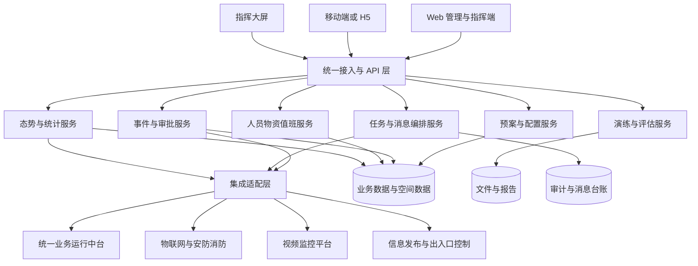

# 应急管理子系统技术方案

- 任务：G1-04 技术方案
- 主责：B
- 复核：A
- 版本：V0.1
- 状态：基线前工作稿
- 需求依据：`docs/用户需求书-03-应急管理子系统.docx`

## 1. 文档目的与边界

本方案描述应急管理子系统的逻辑架构、功能实现、关键技术、数据接口、非功能设计和验证路径，为 A 整合技术投标书提供唯一技术源稿。

当前 G1-01/G1-02 尚未完成。本稿只固化可由原始需求直接确认的逻辑设计，不选择会形成额外商业承诺的具体产品，不填写尚未进入 `control/key_numbers.md` 的指标值。所有需求编号、实质性条款、性能指标、项目边界、验收条件和服务承诺，在 V0.2 更新时必须与 C 冻结的事实基线逐项对齐。

## 2. 设计目标

系统以数字化预案为核心，以应急指挥为枢纽，以移动处置为延伸，形成事前准备、事发接报、事中处置和事后评估的闭环。技术设计重点保障：

- 日常管理与应急处置使用同一套人员、预案、资源和流程数据。
- 预案启动后，通知、任务和调度状态可并行处理并全程追踪。
- 人员、视频、物资和事件信息能按空间位置聚合展示。
- 外部系统通过标准接口接入，故障不会无提示地阻断核心业务。
- 流程、类型和模板通过受控配置调整，并保留版本与变更记录。
- 系统适合私有、隔离环境部署，具备安全、审计、备份和恢复能力。

## 3. 总体逻辑架构

### 3.1 应用层

- Web 管理端：预案、事件、资源、演练、值班、配置和统计管理。
- 应急指挥端：事件态势、任务进展、人员位置、视频和物资的集中调度界面。
- 移动端：事件上报、任务处置、演练、值班打卡、知识查询和物资盘点。
- 指挥大屏：应急信息和综合安防态势展示，不直接承担高风险业务写操作。

### 3.2 接入与服务层

统一接入层负责身份验证、权限校验、请求追踪、限流和接口版本管理。业务服务按领域拆分，逻辑上相互解耦；实际采用模块化单体还是微服务部署，须结合招标人资源、团队运维能力和 G1-02 基线后决定。

### 3.3 数据与支撑层

结构化业务数据、空间数据、文件、审计日志和消息台账分责管理。统一身份、消息、流程和文件能力优先复用统一业务运行中台；复用能力不足时通过适配层补齐，避免业务模块直接绑定单一厂商接口。

### 3.4 集成适配层

每类外部系统设置独立适配器，负责协议转换、鉴权、数据校验、超时、重试、熔断和审计。业务服务只使用内部统一模型，使外部平台版本变化不会扩散到核心业务。

## 4. 领域与功能实现

| 领域 | 覆盖模块 | 核心职责 | 关键技术关注点 |
| --- | --- | --- | --- |
| 预案与配置 | F-01、F-07 | 预案、处置流程、任务模板、类型、报告模板和审批流程 | 版本、发布审批、引用一致性、运行实例快照 |
| 指挥与事件 | F-02、F-05 | 接报、核实、启动、处置、关闭、评估和调查 | 生命周期状态机、并发控制、全过程留痕 |
| 资源与值班 | F-03、F-06 | 人员、物资、盘点、排班、点位、打卡和预警 | 空间数据、任务生成、差异校验、异常复核 |
| 演练 | F-04 | 周期计划、任务生成、演练执行和评估 | 调度可靠性、演练与真实事件隔离、评估闭环 |
| 移动协同 | F-08 | 上报、接收任务、反馈、扫码、定位和盘点 | 身份、设备权限、弱网提示、数据幂等 |
| 态势与统计 | F-09、F-10 | 应急指标、安防状态、筛选、钻取和跳转 | 聚合口径、缓存、刷新、源数据一致性 |
| 系统集成 | F-11 | 物联网、中台、视频、信息发布和开放 API | 契约、适配、重试、补传、限流和审计 |

### 4.1 事件处置主流程

1. Web、移动端或外部告警形成事件或事件线索。
2. 系统保存来源、时间、位置、类型和原始数据摘要，并执行重复检测。
3. 按已发布的核实审批流程完成核实；每个动作记录操作者、时间和意见。
4. 核实通过后选择预案并创建本次处置快照，避免预案后续修改影响正在运行的事件。
5. 启动命令生成唯一幂等标识，同时创建任务、通知和调派记录。
6. 任务与消息并行下发；接收、处置、反馈和完成状态持续汇聚到指挥中心。
7. 事件关闭前检查关键任务状态，随后开展应急评估和事故调查。
8. 评估结论形成预案修订建议和知识条目，完成闭环。

### 4.2 演练流程

演练计划按周期生成任务，但演练实例使用独立类型和醒目标识。演练可复用预案流程和任务编排能力，数据查询、统计和消息模板必须能区分演练与真实事件，避免演练消息被误认为真实警情。

### 4.3 值班打卡流程

值班计划与打卡小组、点位和时间窗共同生成打卡任务。移动端提交身份、点位二维码、位置、时间和设备上下文；服务端完成任务归属、时间窗、二维码签名和地理围栏校验。定位不可用或质量不足时不伪造成功结果，应明确拒绝或标记异常并进入复核。

### 4.4 物资盘点流程

盘点任务保存盘点前台账快照。执行人逐项提交实盘数量，系统计算差异并要求确认；经核查后更新现有数量，同时保留原值、变更值、操作者和时间，确保台账变化可追溯。

## 5. 关键技术设计

### 5.1 预案启动的并行编排

预案启动采用“持久化启动记录—生成任务快照—写入可靠待发送记录—并行处理—状态汇聚”的链路。启动请求携带幂等键，重复请求返回同一执行结果。任务生成、通知发送和调派可并行，但业务状态以持久化记录为准，不能以进程内临时状态作为唯一依据。

关键链路分别记录接收时间、入库时间、进入队列时间、平台受理时间和终端回执时间，为后续性能验收提供可计算证据。具体阈值待 `control/key_numbers.md` 确认。

### 5.2 消息可靠推送

建立统一消息适配器和消息台账。每条消息具有业务幂等键、接收人、通道、尝试次数、平台受理结果和到达状态。可重试失败进入退避重试，不可重试失败直接告警；超过策略仍未送达的消息进入人工处置队列。系统区分“请求已提交”“平台已受理”和“终端已到达”，避免用平台受理冒充到达率。

### 5.3 事件态势一张图

以事件位置为中心组织人员、视频、物资站点和告警图层。服务端按统一楼栋、楼层和坐标模型输出数据，前端采用增量更新，避免每次刷新全部图层。位置点显示采集时间、精度和在线状态；陈旧或低质量位置使用不同状态提示。空间查询、图层缓存和聚合接口共同保障地图操作性能。

### 5.4 视频联动

视频适配器负责设备目录、实时取流、录像检索、鉴权和错误映射。指挥界面先加载摄像机元数据，再异步建立播放链路，并记录取流和首帧时间。视频平台不可用时，系统保留事件处置主链路，明确显示视频故障并提供重试或人工调阅信息。

### 5.5 配置化流程和模板

流程、类型和报告模板使用“草稿—校验—发布—停用”的受控生命周期。每次发布生成不可变版本；新事件使用新版本，运行中事件保留启动时快照。配置变更记录修改人、时间、前后版本和原因。流程设计器仅开放经过验证的节点和规则，防止任意脚本破坏安全和可维护性。

### 5.6 跨系统联动

外部调用统一设置请求标识、业务幂等键、超时、重试上限、熔断和结果审计。查询类接口可在短时故障时展示缓存和数据时间；指令类接口不得把超时当作失败后立即重复执行，必须先查询执行状态或使用幂等接口，避免重复发布或重复开门。

### 5.7 移动端扫码与定位校验

点位二维码至少包含点位标识和防篡改签名，不直接暴露敏感业务数据。打卡由服务端校验人员身份、任务、时间窗、点位、允许范围和重复提交。移动端只采集必要数据并展示定位权限和失败原因；异常打卡保留核验所需证据，并按权限限制访问。

## 6. 数据设计

核心数据对象包括：预案及版本、流程定义及版本、任务模板、事件、审批记录、处置任务、消息台账、人员与组织、物资站点与物资、盘点任务、演练计划与实例、值班计划、打卡点位与记录、评估报告、调查报告、知识条目、接口调用记录和审计日志。

数据设计遵循以下规则：

- 业务主键与外部系统标识分离，保留来源系统和来源标识。
- 事件、任务、消息和接口调用使用关联标识形成端到端追踪。
- 关键过程记录采用追加留痕，状态变化保留操作者、时间和前后值。
- 时间统一保存为带时区语义的标准格式，展示时按北京时间处理。
- 空间数据明确坐标系、楼层和数据采集时间，避免跨系统坐标误用。
- 数据导出、备份、恢复和迁移均记录执行结果与校验信息。

## 7. 接口设计

| 接口域 | 内部统一能力 | 主要可靠性措施 | 当前待确认项 |
| --- | --- | --- | --- |
| 统一中台 | 登录、组织、用户、消息、门户、数据汇聚 | 令牌校验、接口版本、重试、同步水位和审计 | 协议、数据模型、回执和配额 |
| 物联网 | 告警、客流和设备状态 | 去重、断连重试、补传、乱序处理 | 推送方式、事件标识和补传规则 |
| 视频监控 | 目录、实时视频和录像回放 | 连接状态、超时、熔断、错误映射 | 平台版本、流格式和鉴权 |
| 信息发布 | 发布、撤销和结果查询 | 幂等指令、回执、失败告警 | 内容格式、审核和撤销规则 |
| 安防消防及门禁 | 告警接收、联动指令 | 来源校验、幂等、二次确认和审计 | 权限、回执和安全责任边界 |
| 开放 API | 事件、预案、值班、库存和状态订阅 | 令牌、最小权限、限流、版本和调用审计 | 调用方、订阅机制和数据范围 |

正式接口契约在后续《接口设计说明书》中采用 OpenAPI 等机器可读方式表达，并提供请求、响应、错误码和幂等规则。G1-04 阶段先确定接口边界与可靠性策略。

## 8. 非功能设计

### 8.1 性能与容量

围绕预案启动、告警接入、消息推送、人员位置、视频首帧、普通页面、地图操作、扫码回传、视图刷新、在线用户和报表生成分别建立测量点。采用链路追踪、队列深度、接口延迟、慢查询和前端性能指标定位瓶颈。具体负载模型与通过阈值待 C 将 PE 指标纳入基线后填写。

### 8.2 可靠性与恢复

核心服务提供健康检查和结构化日志；未完成任务与未送达消息持久化，服务重启后可以继续处理。外部系统故障通过超时、熔断、缓存或人工入口降级，不阻断事件记录和处置主链路。备份和恢复设计须结合招标人基础设施，并通过实际恢复演练验证。

### 8.3 安全

系统复用统一身份认证，采用角色与数据范围结合的授权模型。所有关键操作在服务端鉴权并记录审计；接口使用令牌、传输加密、限流和重放防护。文件上传校验类型、大小和内容安全；口令、密钥及敏感配置不以明文存储。交付前执行依赖扫描、漏洞扫描和针对越权、注入及文件上传的安全测试。

### 8.4 可维护性与可移植性

业务规则与代码分离，外部系统通过适配器隔离。部署制品包含离线依赖、容器编排、配置模板、初始化脚本、健康检查和回滚说明。具体技术栈、数据库和部署节点数量在资源条件确认后选定，并记录选择理由。

### 8.5 可观测性

日志统一包含时间、请求标识、事件标识、任务或消息标识、调用方、结果和耗时。监控覆盖服务健康、接口错误、消息积压、发送失败、数据库性能、存储容量和外部系统连通性。告警需要明确责任人、处置说明和恢复条件。

## 9. 验证方案骨架

| 验证主题 | 验证方法 | 主要证据 | 基线后补充 |
| --- | --- | --- | --- |
| 预案启动 | 构造含通知人、任务和调派人员的预案，重复执行启动并注入部分失败 | 链路时间、任务快照、发送台账、回执和幂等结果 | PE/FR 阈值与样本量 |
| 消息可靠性 | 并行发送，模拟限流、超时、临时失败和永久失败 | 尝试记录、重试轨迹、回执统计和人工处置记录 | 通道配置与通过标准 |
| 态势一张图 | 注入人员、视频、物资和事件数据，执行楼层切换、缩放和增量刷新 | 页面录屏、接口耗时、数据时间和图层一致性 | 数据规模与性能阈值 |
| 跨系统联动 | 逐项验证告警转事件、视频调阅、信息发布和中台同步，并模拟断连 | 请求响应、接口审计、降级提示和恢复记录 | 联调环境与验收脚本 |
| 配置化流程 | 发布新流程版本，分别启动新旧实例并执行异常路径 | 版本记录、实例快照、流转记录和审计日志 | 必测节点和规则范围 |
| 移动打卡 | 测试正常、越界、超时、重复、代执行和定位异常 | 校验结果、异常标记、位置质量和打卡审计 | 允许范围与终端矩阵 |
| 安全与权限 | 执行身份、越权、注入、上传、限流和审计检查 | 扫描报告、测试记录、修复复测和权限矩阵 | 等保条款与验收工具 |
| 部署与恢复 | 在干净隔离环境离线部署，执行备份、恢复和服务重启 | 部署日志、制品校验、恢复记录和健康检查 | 环境配置与时间阈值 |

## 10. 待基线完成后的更新清单

1. 将全部 FR、PE、实质性条款和验收方式与 `control/compliance_matrix.md` 建立映射。
2. 将文中的性能、容量、可用性、保留期、部署和服务数字统一引用 `control/key_numbers.md`。
3. 根据 `G1-04_technical_questions.md` 的答复确定接口协议、部署拓扑和具体技术选型。
4. 为总体架构图补充部署节点、网络安全域和数据流向。
5. 为每项关键技术补充需求编号、验证步骤、通过标准和证据负责人。
6. 将技术风险交给 A 纳入 G1-07，并在计划中安排高风险接口的前置验证。
7. 完成自检后提交 A 复核；问题通过 `control/issues.md` 闭环。
