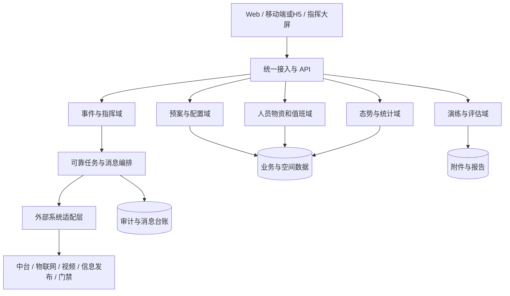

# 应急管理子系统技术方案

- 任务：G1-04 技术方案
- 主责：B
- 复核：A
- 版本：V0.2
- 状态：`DRAFT_PENDING_BASELINE_AND_CLARIFICATION`
- 需求依据：`control/facts.md`、`control/key_numbers.md`、`docs/work/C_REQ/requirements_clause_catalog.md`
- 技术复核：`logs/reviews/2026-09-09_G1-01_B-technical-review.md`

## 1. 方案目的与约束

本方案覆盖应急管理子系统的总体架构、功能实现、关键技术、数据与接口、非功能设计和验证路径，为 A 整合技术投标书提供 B 主责的技术源稿。

系统以数字化预案为核心、指挥中心为枢纽、移动处置为延伸，覆盖事前准备、事发接报、事中处置和事后评估。建设范围包括 Web、移动端、数据接口、配套文档和培训，共 11 个模块、39 条功能需求，其中 34 条为 ★。

以下边界必须保持：

- 不采购或改造既有视频、入侵、门禁、消防、广播、客流等系统的前端硬件。
- 不采购定位基站、应急物资、安防终端、机房、服务器、网络或政府平台专线。
- 业务数据部署并保存在甲方内部环境，不向境外或第三方公共服务传输。
- 未指定具体编程语言、数据库、中间件或厂商产品；技术栈在环境清单和 G1-02 基线明确后确定。
- ISSUE-001—003 保持条件设计，不以技术推断代替招标人书面澄清。

## 2. 需求到技术域的映射

| 技术域 | 模块与 FR | 主要能力 | 关键事实/数字 |
| --- | --- | --- | --- |
| 预案与配置 | F-01、F-07；FR-01.1—01.4、07.1—07.5 | 分层预案、流程、任务、会议群组、通知调派、类型和模板、版本发布 | F-100—103、F-123—127；KN-003、018、019 |
| 指挥与事件 | F-02、F-05；FR-02.1—02.4、05.1—05.4 | 接报、核实、启动、任务、态势、关闭、评估、调查 | F-104—107、F-115—118；KN-011、012 |
| 人员物资和值班 | F-03、F-06；FR-03.1—03.4、06.1—06.4 | 人员、物资、盘点、排班、点位、打卡、预警 | F-108—111、F-119—122；KN-022—026、036 |
| 演练 | F-04；FR-04.1—04.3 | 周期计划、自动任务、执行、评估和改进 | F-112—114；KN-013 |
| 移动协同 | F-08；FR-08.1—08.6 | 事件、任务、知识、演练、打卡、盘点 | F-128—133；KN-015、ISSUE-007 |
| 态势统计 | F-09、F-10；FR-09.1、10.1 | 应急与安防指标、筛选、钻取、定位和跳转 | F-134—135；KN-016、017、037 |
| 系统集成 | F-11；FR-11.1—11.3 | 物联网、中台、视频、信息发布、门禁和开放 API | F-136—138、F-208；KN-006—010、064 |

## 3. 总体逻辑架构

统一接入层负责身份验证、权限、限流、请求追踪和接口版本。业务按领域模块化，服务之间使用稳定内部模型。外部系统差异集中在适配层，避免厂商接口、编码或版本变化扩散到核心业务。

在甲方资源规模和运维能力确认前，逻辑架构不强制映射为微服务。部署可采用模块化单体或少量服务，以满足可维护、离线交付和两小时内干净环境部署为优先目标。

## 4. 核心业务设计

### 4.1 预案版本与启动

预案定义包含基本信息、适用区域和风险、处置流程、任务模板、通知人与调派人、会议群组和附件。草稿、待审批、已发布、停用形成受控状态；已发布版本不可原位覆盖。

启动时生成预案快照、任务快照和收件人快照。请求携带事件 ID、预案版本和幂等键；重复请求返回同一启动结果。任务生成、通知发送和调派并行执行，持久化状态作为唯一依据。目标是通知与任务下发不超过 3 秒（KN-003）。

### 4.2 事件生命周期

事件状态至少覆盖线索/待核实、核实中、已确认、处置中、待关闭、已关闭。Web、移动端和外部告警均保留来源、原始标识、接收时间、位置与原始报文摘要。

报警接入响应不超过 2 秒（KN-011）；从事件确认到任务下达不超过 3 分钟（KN-012）。关闭前校验关键任务状态，随后进入评估、调查、报告与知识沉淀，形成预案修订建议。

### 4.3 任务与消息闭环

任务状态包含待发送、已发送、已接收、处理中、已反馈、已完成、失败/超时。每次状态变化记录操作者、时间、渠道、来源和关联事件。

消息台账分别记录“平台受理”“通道发送”“终端到达/确认”，避免把接口调用成功误算为到达。支持不少于 20 路并行推送（KN-006），目标到达率不少于 99%（KN-007）。失败按可重试错误与永久错误分类；重试耗尽后在指挥端提示未送达对象并提供人工联系入口。

### 4.4 值班打卡与物资盘点

值班计划结合小组、点位和时间窗口生成任务。移动端提交身份、点位二维码、位置、采集时间和设备上下文；服务端校验任务归属、时间窗口、二维码签名和地理范围。写入/回传不超过 1 秒（KN-036）。定位不可用或质量不足时不伪造成正常结果，进入异常复核。

盘点任务保存盘点前台账快照。系统计算实盘与账面差异，经复核后更新数量，并保留原值、实盘值、差异、确认人和时间。

### 4.5 演练与真实事件隔离

演练可复用预案、流程、任务和消息编排，但使用独立类型和醒目标识。查询、统计、通知模板和审计证据必须区分演练与真实事件，防止演练消息被误认作真实警情。

## 5. 外部集成与条件设计

| 集成项 | 内部适配契约 | 可靠性与安全控制 | 条件/Issue |
| --- | --- | --- | --- |
| 统一中台 | 身份、组织、消息、门户、数据汇聚分接口 | 令牌校验、组织版本、停用同步、失败隔离 | ISSUE-005、010 |
| 物联网/安防消防 | 告警、恢复、设备状态、客流 | 来源标识、去重、乱序、断点和补传 | ISSUE-010 |
| 视频平台 | 设备目录、实时流、录像检索、历史播放 | GB/T 28181、鉴权、超时、断流恢复 | ISSUE-001、010 |
| 信息发布 | 发布、撤销、状态查询 | 幂等、审批/确认、结果回执、审计 | ISSUE-010 |
| 门禁 | 开启指令、状态查询、结果回执 | 最小授权、二次确认、幂等、超时告警 | ISSUE-003 |
| 定位 | 人员、设备、楼栋、楼层、坐标、时间、精度 | 新鲜度、精度标识、坐标转换、异常隔离 | ISSUE-002 |
| 短信/消息 | 批量发送、状态、回执 | 配额、限流、重试、台账、人工兜底 | ISSUE-004 |

开放接口采用 REST 风格并交付 OpenAPI 3.0 文档。接口统一版本、时间格式、追踪 ID、分页、错误码、鉴权和限流规则。写接口支持幂等；回调校验签名、防重放并保存处理结果。原始报文仅按必要范围留存或保存摘要，敏感字段脱敏。

### 5.1 视频与定位责任边界

视频录像保存不少于 30 天（KN-060）及历史回放能力依赖既有平台或甲方提供的存储条件；本项目不新建录像存储。实时视频首帧不超过 3 秒（KN-010），在现场真实链路测量。

人员位置刷新不超过 2 秒/次、精度达到亚米级（KN-008、009）的验收，必须由甲方提供覆盖完整且达到指标的定位数据源。本项目负责接入、转换、展示、质量标识和端到端验证，不承担范围外定位设施建设。

## 6. 数据设计

### 6.1 主题与关系

数据分为预案、附件报告、事件任务、资源、值班、演练、空间、知识库和系统九类。核心关系为：事件引用已发布预案并保存快照；预案快照生成任务；任务关联人员、组织、消息和反馈；空间对象关联楼栋、楼层、点位、人员或物资；所有关键动作关联审计记录。

### 6.2 容量与保留

| 对象 | 设计下限 |
| --- | --- |
| 预案 / 任务模板 | ≥50 个 / ≥200 条 |
| 事件 / 任务 | 在线 ≥10 年、≥2 万事件、≥20 万任务 |
| 人员 / 物资站点 / 物资台账 / 打卡点 | ≥300 人 / ≥30 站点 / ≥1000 项 / ≥100 点 |
| 打卡记录 | 约 200 人次/日、7.3 万/年，在线 ≥3 年 |
| 并发用户 | 日常 30—50 人；应急峰值 ≥100 人 |
| 过程数据 | 事件、打卡、演练 ≥3 年 |
| 审计日志 | ≥180 天 |

容量验证使用接近上述上限的数据集，分别检查写入、查询、统计、备份和恢复。归档不能破坏需求—设计—测试追踪或事件全过程证据。

### 6.3 数据安全与恢复

敏感数据按角色和数据范围授权；导出必须鉴权并审计。过程数据采用追加式历史、版本或不可静默覆盖的变更记录。执行每日增量、每周全量备份，介质由甲方管理；定期验证恢复点和恢复流程。

## 7. 非功能设计与验收口径

| 类别 | 需求阈值 | 设计措施 | 验证证据 |
| --- | --- | --- | --- |
| 功能 | 覆盖率 100%，用例通过率 100%，关键操作 ≤3 次页面跳转 | FR—设计—用例双向追踪；关键路径导航 | RTM、测试报告、页面录屏 |
| Web 性能 | 95% 普通页面 ≤3 秒 | 分页、索引、缓存、静态资源优化 | 浏览器与服务端计时、P95 报告 |
| 地图 | 常规操作 ≤2 秒 | 分层加载、视口查询、空间索引 | 平移缩放选点脚本与录屏 |
| 统计 | 一年期报告 ≤5 秒 | 预聚合、索引、异步导出边界 | 固定数据集报告 |
| 并发 | 峰值 ≥100 在线用户 | 主链路容量模型、连接池、限流 | 负载报告、资源曲线、错误率 |
| 可用性 | 7×24；试运行 ≥99.5% | 健康检查、故障隔离、重启恢复 | 试运行日志、可用率计算 |
| 恢复 | 单点故障 MTTR ≤2 小时 | 备份恢复、部署重建、操作手册 | 故障演练计时与恢复校验 |
| 安全 | 不低于等保二级应用要求；高危漏洞 0；口令 ≥8 位 | RBAC、服务端鉴权、令牌、限流、审计、SCA/扫描/渗透 | 扫描、渗透、越权复测报告 |
| 可维护 | 核心模块单测覆盖率 ≥70% | 模块边界、自动构建、结构化日志 | 覆盖率报告、构建记录 |
| 可移植 | 干净环境一键部署 ≤2 小时且一次成功 | 容器化、离线制品、配置代码分离、校验脚本 | 非乙方人员独立部署记录 |
| 兼容 | Chrome/Edge 最新 2 个稳定版；Android/iOS/H5 | 兼容矩阵、能力检测、宿主桥接隔离 | 目标终端与浏览器报告 |

## 8. 可观测与性能计量

关键链路统一使用追踪 ID，记录接收、入库、排队、外部平台受理、回执和完成时间。性能口径如下：

- 预案下发时延 = 最后一条应生成任务/通知进入可靠待发送状态时间 − 启动请求受理时间。
- 告警接入响应 = 系统形成可查询告警或事件线索时间 − 网关接收时间。
- 视频首帧 = 用户发起播放至播放器呈现首个有效画面的时间。
- 定位刷新 = 相邻有效定位采集时间差；端到端展示延迟另行统计，不混用口径。
- 消息到达率 = 在约定窗口获得终端到达/确认回执数 ÷ 应发送数；仅平台受理不能计为终端到达。
- 可用率 = （试运行总时间 − 计划维护 − 不可用时间）÷（试运行总时间 − 计划维护）。

## 9. 部署、运维与交付

交付容器镜像或等效离线制品、编排文件、环境变量模板、初始化与升级脚本、校验和、回滚说明、健康检查、备份恢复脚本和运维手册。配置与代码分离，密钥不进入镜像和仓库。

部署拓扑和最低 CPU、内存、存储配置必须等甲方提供 ISSUE-008 环境清单后通过容量验证确定。正式验收由非乙方人员在干净环境按文档执行，目标不超过 2 小时且一次成功（KN-005、065）。

## 10. 分阶段验证计划

| 阶段 | 验证内容 | 准出证据 |
| --- | --- | --- |
| M1 需求确认 | 39 FR、全部 ★、12 Issue、范围和数字复核 | 冻结基线、澄清答复、RTM 初版 |
| M2 设计评审 | 架构、数据、接口、安全；视频和消息真实连通 | 设计评审记录、契约测试、接口样例 |
| M3 初验 | 单元、集成、系统测试；功能、性能、兼容、安全 | 四级测试记录、性能报告、缺陷闭环 |
| 试运行 | 7×24、≥99.5%、至少一次真实演练、故障恢复 | 运行日志、演练和故障演练记录 |
| M5 竣工验收 | 100% FR/用例、四系统联动、高危清零、独立部署 | RTM、联合演练、复测与部署验收 |

四系统端到端联动覆盖视频、信息发布、物联网和中台（KN-064）。所有 ★条款须有对应设计、用例和证据，不能用降级方案替代验收。

## 11. 当前未决项与版本出口

V0.2 已吸收 C-01 中状态为 VERIFIED 的事实和数字，并对依赖项给出技术边界。进入 A 复核前仍需：

1. C/招标人关闭 ISSUE-001—003，并处理其余待澄清项。
2. C 完成并冻结 G1-02 BASELINE-V0.1。
3. G1-05 建立完整合规矩阵，将条款、设计与验证项双向挂接。
4. 甲方提供接口、地图、定位、部署环境和安全责任资料，B 完成相应 PoC 或联通测试。
