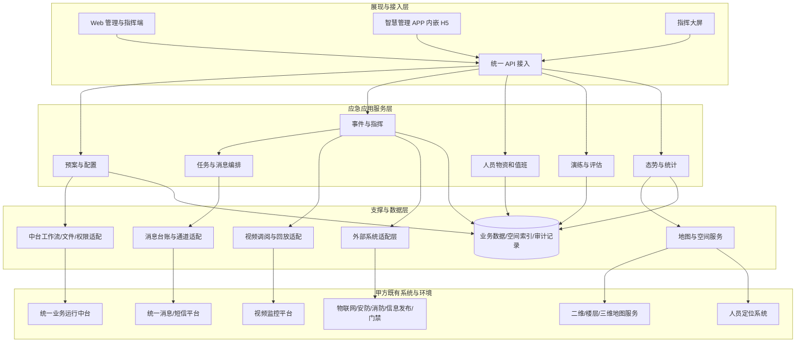

# 某自然博物馆智能运营中心建设项目——应急管理子系统总体技术方案 V0.6

- Task：`G1-04`
- 主责：B
- 用途：第一关技术方案独立工作稿，供 A 后续整合
- 版本：V0.6
- 状态：`SELF_REVIEWED / READY_FOR_INTEGRATION_REVIEW`
- 冻结输入：`control/baselines/BASELINE-G1-V0.1.md`
- 需求范围：11 个功能模块、39 条 FR，其中 34 条 ★
- 澄清口径：`DEC-001`—`DEC-012`，均按甲方模拟书面裁决原意采用

## 编制说明

本方案用于回答三个问题：系统如何构成，关键技术如何满足应急业务，最终如何以可复核证据证明满足需求。方案不指定基线尚未冻结的编程语言、数据库、消息中间件或 GIS 产品，避免将教学案例中的技术栈误写为项目承诺。

系统以数字化预案为核心、应急指挥中心为枢纽、H5 移动处置为延伸，覆盖事前准备、事发预警、事中处置和事后改进。系统部署在甲方私有环境，复用甲方中台、地图、定位、视频、消息和安防消防等既有能力，通过适配层完成业务集成。

# 第 1 部分 总体架构

## 1.1 架构原则

1. **业务闭环。** 预案、事件、任务、消息、人员、物资、值班、演练、态势和评估使用一致的业务标识与状态链路。
2. **分层解耦。** Web/H5 与业务服务解耦，业务服务与外部系统解耦，外部厂商差异集中在适配层。
3. **中台复用。** 身份、组织、权限、消息、工作流、文件存储、门户和数据汇聚由甲方中台提供，本项目只做应急业务适配。
4. **接口可替换。** 每类外部系统采用独立适配器，保留契约、版本、超时、重试、熔断、回执、降级与审计。
5. **状态可追溯。** 预案、流程、任务和消息保留版本或快照；关键动作、外部调用和人工降级均可回查。
6. **私有化与可移植。** 采用容器化交付、配置与代码分离、离线制品和自动检查，支持隔离网络安装。

## 1.2 总体逻辑架构

逻辑分层不等于强制采用大量微服务。实施时可按甲方资源和运维能力选择模块化部署或少量独立服务，但业务边界、适配边界和数据责任保持不变。

## 1.3 Web 端

Web 端服务于应急指挥人员、值班人员、资源管理员、演练管理人员和系统管理员，提供预案配置、事件核实与启动、任务调度、资源和值班管理、演练评估、态势统计和系统配置。

- 关键操作从首页或工作台不超过 3 次页面跳转可达（KN-033）。
- 普通业务页面 95% 请求在 3 秒内完成（KN-034）。
- 指挥页面对事件、任务、消息、人员位置、视频和物资采用分区展示，写操作必须明确反馈结果。
- 高风险门禁开启指令只对授权人员开放，确认后下发，不绕过既有安全联锁。

## 1.4 移动端

移动端固定为 H5，嵌入甲方现有智慧管理 APP。乙方交付 H5 应用、H5 包、业务接口和必要宿主适配；甲方负责宿主 APP、签名和发布，不另行开发原生 Android/iOS APP（DEC-007）。

H5 覆盖移动事件上报、任务接收与反馈、知识查询、演练执行、扫码打卡和物资盘点六类功能（KN-015）。宿主适配统一封装登录态、消息跳转、定位、扫码、拍照和文件上传能力；能力不可用时给出明确提示并记录异常，不伪造成成功结果。

## 1.5 应用服务

| 领域服务 | 主要职责 | 对应范围 |
| --- | --- | --- |
| 预案与配置 | 分层预案、处置流程、任务模板、通知/调派、类型、评估模板、版本发布 | F-01、F-07 |
| 事件与指挥 | 上报、告警接入、核实审批、预案启动、处置、关闭、事故调查 | F-02、F-05 |
| 任务与消息编排 | 任务快照、并行下发、催办、反馈、回执、失败补偿 | FR-01.3、FR-05.3、FR-08.2 |
| 人员物资和值班 | 人员小组、物资台账、盘点、排班、点位、打卡、预警 | F-03、F-06 |
| 演练与评估 | 周期计划、自动任务、执行、评估报告、改进闭环 | F-04 |
| 态势与统计 | 应急信息、综合安防、筛选、钻取、地图叠加和报表 | F-09、F-10 |
| 集成适配 | 中台、视频、消息、地图、定位、物联网、信息发布、门禁、安防消防 | F-11 |

## 1.6 数据层

数据主题包括预案、附件报告、事件任务、人员物资、值班打卡、演练、空间、知识库和系统审计。关键关系采用稳定业务 ID：事件引用已发布预案并保存快照，预案快照生成任务，任务关联人员、消息和反馈，空间对象关联楼栋、楼层和点位。

| 数据对象 | 基线容量或保留要求 |
| --- | --- |
| 应急预案 / 处置任务模板 | 不少于 50 个 / 200 条（KN-018、KN-019） |
| 在线事件 / 任务 | 不少于 10 年、2 万事件、20 万任务（KN-021） |
| 人员 / 物资站点 / 物资台账 / 打卡点 | 不少于 300 人 / 30 个 / 1000 项 / 100 个（KN-022、KN-023、KN-024、KN-025） |
| 打卡记录 | 约 200 人次/日、7.3 万/年，在线不少于 3 年（KN-026） |
| 事件、打卡、演练过程数据 | 不少于 3 年（KN-029） |
| 审计日志 | 不少于 180 天（KN-030） |
| 在线用户 | 日常 30—50 人，应急峰值不少于 100 人（KN-027、KN-028） |

过程数据通过版本、历史表或追加式事件记录避免静默覆盖。敏感数据按角色和数据范围控制，导出行为进入审计。执行每日增量、每周全量备份；甲方提供备份介质，乙方提供备份恢复方案并验证恢复结果。

## 1.7 地图与 GIS

甲方提供合法使用的二维地图、楼层图及验收所需既有三维地图/场景或服务；乙方负责加载、兼容、坐标拾取、点位标注和业务叠加，不承担重新测绘、从零三维建模或购买基础地图版权（DEC-006）。

内部空间模型统一楼栋、楼层、区域、点位、坐标系、数据时间和来源。事件、人员、物资站点、打卡点、安防告警和摄像机使用相同空间引用。地图适配器负责源坐标转换和楼层编码映射，前端按视口和图层分批加载。

## 1.8 消息能力

甲方提供统一消息通道、APP 推送、短信能力、账号、签名和配额；乙方负责调用、编排、并发、重试、回执、留痕和降级（DEC-004）。

消息台账分别记录业务待发送、平台受理、通道发送、终端到达/确认和失败状态。每条消息使用业务幂等键，失败按可重试与永久失败分类；重试耗尽后在指挥端展示未送达对象，并保留人工联系和补发入口。

## 1.9 视频能力

历史录像回放为强制要求。甲方既有视频系统负责录像产生、存储和不少于 30 天保存（KN-060）；本项目负责 GB/T 28181 等接口接入、设备目录、实时调阅、录像检索、历史回放、容错和验证，不新建录像存储系统（DEC-001）。

视频适配器将厂商目录、通道状态、实时流和录像检索结果转换为内部统一模型。前端记录用户播放请求、流地址获取和首帧呈现时间；断流、鉴权失败或既有录像不存在时明确显示原因并形成审计证据。

## 1.10 接口层与外部系统

| 外部能力 | 甲方提供 | 乙方实现 |
| --- | --- | --- |
| 统一中台 | 身份、组织、权限、消息、工作流、文件、门户、数据汇聚 | 应急业务适配、映射、容错和验证，不重复建设通用能力 |
| 视频监控 | 平台、接口、账号、录像及不少于 30 天保存 | 实时调阅、历史回放、首帧和保存条件验证 |
| 定位 | 基础设施、亚米级源数据和验收条件 | 人员关联、坐标/楼层映射、刷新、展示，不降低源精度 |
| 物联网及安防消防 | 平台、设备与告警数据、接口和窗口 | 去重、映射、断连补传、告警转事件、联动验证 |
| 信息发布 | 系统、账号和接口 | 发布/撤销、回执、失败处理和审计 |
| 门禁 | 既有门禁、授权机制和安全联锁 | 授权确认后下发、幂等、回执、失败告警与人工降级 |
| 消息/短信 | 通道、账号/签名/配额和联调条件 | 并行、重试、回执、留痕、降级和验证 |

对外开放接口采用 REST 风格并交付 OpenAPI 3.0 文档。接口统一版本、鉴权、请求追踪 ID、时间格式、分页、错误码和限流规则。写接口支持幂等，回调校验签名并防重放。视频和统一消息通道在 M2 设计评审前完成真实连通性验证（DEC-010）。

## 1.11 部署架构与最低配置交付

系统部署在甲方私有环境。甲方提供机房、服务器、网络、域名/证书、备份介质和后备电源；乙方提供容器化制品、编排文件、初始化与升级脚本、环境变量模板、健康检查、校验和、回滚及备份恢复说明。

V0.6 冻结最低**能力配置**，避免在甲方尚未提供 CPU、内存、存储和安全域清单时虚构硬件数字：

- 应用运行、数据持久化、文件存储、审计与备份恢复角色完整；
- 关键服务与数据目录使用持久化存储，重建容器不丢业务数据；
- 支持隔离网络离线安装，所有制品带版本与校验和；干净环境部署不超过 2 小时（KN-005）；
- 端口、域名、证书、时间同步、备份介质和后备电源接入条件形成部署清单；
- 资源必须经不少于 100 人应急峰值、规定数据容量和关键性能场景验证；
- 最终 CPU、内存、存储最低数值在甲方环境清单取得后，以容量测试结果固化进部署方案，不引用教学案例参数。

# 第 2 部分 关键技术

## 2.1 秒级预案启动

**技术问题：** 预案启动会同时产生任务、通知、调派和状态汇总；同步串行调用外部平台容易超时，重复点击还可能产生重复任务。

**实现路线：** 启动请求先完成权限、事件和预案版本校验，再在本地事务中写入启动记录、预案快照、任务快照和可靠待发送记录。每次启动使用事件 ID、预案版本和业务幂等键；通知、任务和调派从可靠记录并行执行，外部回执异步归集。失败步骤可定向重试，不回滚已经成立的事件事实。

**指标保障：** 预案启动通知/任务下发不超过 3 秒（KN-003）。3 秒口径以应生成任务和通知全部进入可靠待发送状态为准，外部终端到达时间由消息回执另行计算。

> **怎么证明它能满足需求：** 在接近容量上限的预案模板下重复启动，采集请求受理、快照落库和最后一条待发送记录形成时间；验证 P95/P99、任务完整性、重复请求幂等和局部失败重试，输出追踪日志与性能报告。

## 2.2 消息可靠推送

**技术问题：** 接口调用成功不等于终端到达，批量发送还受到配额、限流、临时故障和回执延迟影响。

**实现路线：** 使用消息台账、业务幂等键、并行发送、指数退避或通道允许的重试策略、回执归集和失败队列。严格区分平台受理、通道发送和终端到达/确认；永久失败立即告警，可重试失败进入受控重试，最终失败支持人工补发或联系。

**指标保障：** 在甲方提供的正常可用验收通道内支持不少于 20 路并行，终端到达率不低于 99%（KN-006、KN-007）。

> **怎么证明它能满足需求：** 在真实验收通道构造批量收件人，记录应发送数、各阶段回执、耗时和最终到达数；执行正常、限流、超时、重复回执、失败重试和人工降级用例，按“有效到达回执数/应发送数”计算到达率。

## 2.3 事件态势一张图

**技术问题：** 地图需要同时叠加事件、人员、物资、打卡点、视频和安防告警；来源坐标、楼层编码、刷新频率不同，直接混合会造成错位和卡顿。

**实现路线：** 建立统一空间对象模型和楼栋—楼层—区域—点位层级，源数据通过适配器完成坐标与楼层映射。地图按视口、楼层和业务图层加载，动态位置与静态底图分离刷新；每个动态对象携带来源、采集时间、精度和在线状态。

**指标保障：** 地图常规操作不超过 2 秒（KN-035），人员位置刷新不超过 2 秒/次且不降低甲方亚米级源精度（KN-008、KN-009），综合安防视图刷新不超过 30 秒（KN-016），应急信息视图默认不超过 60 秒（KN-017）。

> **怎么证明它能满足需求：** 使用甲方二维、楼层和三维地图服务，在真实定位源下执行平移、缩放、楼层切换、点位拾取和多图层叠加；以已知控制点比对转换前后误差，以采集时间和画面更新时间计算刷新，保存性能记录与现场录屏。

## 2.4 跨系统联动

**技术问题：** 视频、信息发布、物联网、中台、安防消防和门禁的协议、可用性与错误语义不同，外部故障不能无提示阻断核心应急流程。

**实现路线：** 每类系统使用独立适配器和版本化契约，统一超时、重试、熔断、回执、追踪和审计。输入告警保留来源标识并完成去重、乱序和断连补传；输出指令使用幂等键。门禁开启由授权人员确认，服从既有联锁，失败即告警并转人工处置。

**指标保障：** 报警/告警输入响应不超过 2 秒（KN-011）；视频首帧不超过 3 秒（KN-010）；竣工验收完成视频、信息发布、物联网和中台四系统端到端联动（KN-064）。

> **怎么证明它能满足需求：** M2 前先完成视频与消息真实连通；随后逐接口执行契约测试、正常链路、超时、断连、重复输入、补传、错误回执和降级测试。联合演练以同一事件追踪 ID 串联告警、事件、任务、视频、发布和回执证据。

## 2.5 配置化流程

**技术问题：** 预案、核实审批和处置流程会持续调整，若规则硬编码，变更会影响正在运行的事件并削弱审计能力。

**实现路线：** 将预案、流程、任务、通知、调派、类型和评估模板配置化。定义采用草稿、审批、发布、停用生命周期；发布后形成不可原位覆盖的版本。事件启动时保存运行快照，后续定义变更不影响运行实例。限制不受控脚本，所有变更记录操作者、时间和差异。

**指标保障：** 支持不少于 50 个预案和 200 条任务模板（KN-018、KN-019），关键业务在配置变更后仍可追溯至具体版本。

> **怎么证明它能满足需求：** 创建、审批、发布和停用多版本预案，启动旧版本实例后发布新版本，验证运行实例不漂移；执行流程分支、退回、超时和异常恢复用例，并通过审计记录还原全部配置变更。

## 2.6 H5 扫码与定位

**技术问题：** H5 依赖宿主提供登录、定位、扫码、拍照和上传能力，不同终端权限与定位质量会影响打卡可信度。

**实现路线：** 通过宿主桥接适配层调用设备能力，提交身份、任务、点位二维码、位置、采集时间和设备上下文。服务端校验任务归属、时间窗口、二维码签名和地理范围；定位关闭、过期或精度不足时明确拒绝或标记异常复核。盘点和任务反馈使用相同身份与附件安全策略。

**指标保障：** 扫码打卡写入/回传不超过 1 秒（KN-036）；位置刷新不超过 2 秒/次且不降低源精度（KN-008、KN-009）。

> **怎么证明它能满足需求：** 在目标智慧管理 APP 与支持终端矩阵中测试登录续期、扫码、定位、拍照、上传和消息跳转；分别覆盖正常、拒绝权限、过期二维码、越界、弱网、重复提交和定位漂移，保存服务端计时、终端录屏和异常复核记录。

## 2.7 可靠性与恢复

**技术问题：** 外部系统故障、服务重启、网络中断或单点异常不能造成事件、任务和消息状态丢失。

**实现路线：** 关键状态先持久化，异步任务可重放；服务提供健康检查、结构化日志和请求追踪。外部依赖实施超时、熔断和降级；部署、备份和恢复过程脚本化。恢复优先级依次为事件、任务、消息、值班和其他查询统计能力。

**指标保障：** 系统 7×24 连续运行（KN-004），试运行可用率不低于 99.5%（KN-040），单点故障 MTTR 不超过 2 小时（KN-041）。

> **怎么证明它能满足需求：** 在试运行期间以健康检查和业务探针统计可用率；执行进程终止、容器重启、外部接口中断、网络恢复和备份恢复演练，核对恢复时间、未完成任务重放、数据完整性与人工处置补录。

## 2.8 应用安全

**技术问题：** 系统包含人员、事件、位置、视频和高风险联动指令，必须防止越权、伪造、重放、敏感信息泄露和审计缺失。

**实现路线：** 复用中台身份和权限，应用侧实施角色与数据范围校验、最小权限、服务端鉴权、令牌校验、接口限流、输入校验、文件安全控制、敏感字段脱敏和防重放。门禁等高风险指令增加授权确认、幂等、回执和全链路审计。软件供应链维护依赖清单并开展 SCA。

**责任边界：** 乙方负责不低于等保二级中与应用软件直接相关的建设、SCA、漏洞扫描、Web 渗透测试和高危漏洞清零；甲方负责最终定级、备案、基础网络/主机环境及正式第三方等保测评组织（DEC-011）。

**指标保障：** 口令长度不少于 8 位（KN-044），审计日志保留不少于 180 天（KN-030），交付前高危漏洞为 0（KN-043）。

> **怎么证明它能满足需求：** 执行角色/数据越权、令牌失效、重复指令、接口重放、恶意输入、文件上传和限流测试；提交 SCA、漏洞扫描、Web 渗透测试与复测报告，逐项证明高危清零，并抽查审计记录的完整性和防篡改措施。

# 第 3 部分 验证方式

## 3.1 验证原则

验证采用“需求—设计—用例—结果—证据”双向追踪。39 条 FR 和所有非功能条款均须有对应设计和测试；34 条 ★ 功能需求不允许负偏离（KN-063）。功能覆盖率和验收用例通过率均为 100%（KN-031、KN-032）。可实施方案不等于已经验收，本阶段只定义验证方法，实际结果在 M2、M3、试运行和竣工验收阶段形成。

## 3.2 关键指标验证矩阵

| 验证对象 | 通过标准 | 方法 | 主要证据 |
| --- | --- | --- | --- |
| 预案启动 | 通知/任务下发 ≤3 秒 | 容量模板下并发启动，服务端时间戳计时 | 追踪日志、任务完整性、P95/P99 报告 |
| 告警接入 | 响应 ≤2 秒 | 从网关接收到可查询告警/线索计时 | 接口日志、事件记录 |
| 确认到任务下达 | ≤3 分钟 | 真实业务流程端到端计时 | 审批、启动、任务时间线 |
| 消息 | ≥20 路并行、到达率 ≥99% | 正常真实通道批量发送并核对终端回执 | 发送台账、通道与终端回执、统计表 |
| 定位 | 刷新 ≤2 秒/次、亚米级且不降低源精度 | 真实定位源、控制点误差和时间戳比对 | 源报文、转换记录、现场测量 |
| 视频 | 首帧 ≤3 秒；支持实时与历史回放 | 真实目录、取流、录像检索和播放 | 屏幕录制、播放器事件、平台日志 |
| 视频保存条件 | 既有平台录像 ≥30 天 | 抽取跨 30 天录像目录并成功回放 | 平台查询、录像时间、回放记录 |
| Web 页面 | 95% 请求 ≤3 秒 | 目标浏览器和峰值负载下统计 | 浏览器计时、APM/服务端报告 |
| 地图 | 常规操作 ≤2 秒 | 平移、缩放、楼层切换、点位拾取 | 自动计时与录屏 |
| 扫码打卡 | 写入/回传 ≤1 秒 | H5 宿主环境端到端计时 | 终端与服务端时间戳 |
| 态势刷新 | 安防 ≤30 秒；应急默认 ≤60 秒 | 源状态改变到视图更新计时 | 源事件、推送/轮询和页面记录 |
| 峰值并发 | 在线用户 ≥100 人 | 关键路径负载与稳定性测试 | 并发曲线、响应时间、错误率、资源曲线 |
| 年度报表 | 一年期统计 ≤5 秒 | 固定一年数据集重复生成 | 查询计划、计时和结果一致性 |
| 可用性 | 试运行 ≥99.5% | 健康探针结合业务探针统计 | 运行日志、停机事件和计算表 |
| 故障恢复 | MTTR ≤2 小时 | 单点故障和恢复演练 | 故障记录、恢复计时、数据核验 |
| 可维护性 | 核心模块单测覆盖 ≥70% | 统一覆盖率口径执行自动测试 | 覆盖率报告、构建记录 |
| 安全 | 高危漏洞 0 | SCA、扫描、渗透与修复复测 | 工具报告、缺陷闭环、复测报告 |
| 独立部署 | 干净环境 ≤2 小时且一次成功（KN-005、KN-065） | 非乙方人员按运维手册离线部署 | 部署计时、命令记录、健康检查 |

## 3.3 功能验证

1. **预案与配置：** 覆盖分层预案、流程、任务、通知调派、附件、类型、模板、审批和版本；验证已运行实例不受后续版本修改影响。
2. **指挥与事件：** 覆盖上报、核实、审批、启动、态势、任务、关闭、评估和事故调查；验证全过程留痕。
3. **资源和值班：** 覆盖人员、物资、盘点、排班、点位、打卡和预警；验证差异、异常与代执行留痕。
4. **演练：** 覆盖月/季/年计划、自动任务、执行、评估和报告；验证演练与真实事件醒目隔离。
5. **H5：** 覆盖事件、任务、知识、演练、扫码打卡和物资盘点六类功能，并在宿主 APP 验证桥接能力。
6. **态势与统计：** 覆盖应急信息、综合安防、筛选、钻取、定位、跳转和年度报表。
7. **系统集成：** 覆盖中台、物联网、视频、消息、信息发布和门禁的正常、异常、重试、回执与降级链路。

## 3.4 接口与联动验证

每个接口形成一套契约证据：接口版本、字段映射、鉴权、错误码、幂等、超时、重试、回执、降级和测试结果。甲方负责资料、账号、环境和窗口，乙方负责逐接口适配验证。

M2 前完成视频与消息通道真实连通性验证。竣工联动验收至少覆盖视频、信息发布、物联网和中台四个系统；门禁“应支持”另执行授权确认、安全联锁、成功回执、失败告警和人工降级场景。

## 3.5 数据与初始化验证

甲方提供真实业务源数据并确认业务正确性；乙方交付模板、字段映射、清洗转换、导入和技术校验结果。验证包括必填、唯一性、引用完整性、编码、时间、楼层/坐标和导入前后数量对账。缺失业务事实不得由乙方补造，最终初始化成果由双方确认（DEC-009）。

## 3.6 兼容、部署与恢复验证

- Web 验证 Chrome、Edge 最新两个稳定版本（KN-038）。
- H5 在甲方目标智慧管理 APP、Android/iOS 宿主和约定终端矩阵验证。
- 使用完整离线制品在与生产等效的隔离干净环境部署，验证配置替换、初始化、升级、回滚和健康检查。
- 执行每日增量、每周全量备份及恢复演练，核对事件、任务、消息、值班和审计数据。
- 验证关键节点接入甲方后备电源后，基础设施中断与恢复期间的业务连续性和人工补录机制。

## 3.7 分阶段准出证据

| 阶段 | 核心验证 | 准出证据 |
| --- | --- | --- |
| M1 需求确认 | 39 FR、34 条 ★、DEC-001—012、范围与数字 | BASELINE、需求追踪矩阵、澄清记录 |
| M2 设计评审 | 架构、接口、数据、安全；视频与消息真实连通 | 设计评审记录、接口契约、连通报告 |
| M3 初验 | 单元、集成、系统、性能、兼容与安全 | 测试报告、缺陷闭环、性能和安全报告 |
| 试运行 | 7×24、≥99.5% 可用率、真实演练、故障恢复 | 运行日志、演练记录、故障演练记录 |
| M5 竣工验收 | 100% FR 覆盖和用例通过、四系统联动、高危清零、独立部署 | RTM、联合演练、复测报告、部署验收 |

## 3.8 V0.6 自审结论

- 已覆盖用户指定的 Web、H5、应用服务、数据、GIS、消息、视频、接口和外部系统。
- 已覆盖秒级预案启动、可靠消息、一张图、跨系统联动、配置化流程、H5 扫码/定位、可靠性和安全。
- 每项关键技术均给出技术问题、实现路线、指标保障和“怎么证明”。
- 已按 DEC-001—012 消除旧 V0.2 中“待澄清”“移动端或 H5”等过时表述。
- 未修改 Word 总文件，未修改 A/C 主责产物，未把现场尚未执行的验证写成已经通过。
- 本稿可交 A 做整合审阅，C 可据此在 G1-05 建立逐条合规与验证映射。

## 3.9 全部 FR 技术响应索引

本索引用于将 39 条功能需求直接挂接到实现章节和验证证据，供 C 编制 G1-05 合规矩阵、A 整合 G1-08 技术投标书。表中“验证证据”表示后续应形成的证据，不表示现阶段已经完成现场验收。

| FR | ★ | 功能响应 | 实现位置 | 验证证据 |
| --- | --- | --- | --- | --- |
| FR-01.1 | ★ | 分层预案编制及分区、分时、分险细化 | §1.5、§2.5 | 预案层级、字段、保存、发布及版本用例 |
| FR-01.2 | ★ | 配置处置流程、任务、会议群组、通知人与调派人员 | §1.5、§2.5 | 流程配置、发布、运行快照和审计记录 |
| FR-01.3 | ★ | 自定义任务并在预案启动时自动下发 | §2.1 | ≤3 秒计时、任务完整性、幂等与重试证据 |
| FR-01.4 | 否 | 预案附件、检索、修订与版本管理 | §1.5、§2.5 | 附件权限、检索和多版本回溯用例 |
| FR-02.1 | ★ | 展示事件动态、续报、时间线、任务状态与处理人 | §1.5、§2.3 | 同一事件时间线及状态一致性用例 |
| FR-02.2 | ★ | 地图展示周边人员位置、职责与就位 | §1.7、§2.3 | ≤2 秒刷新、源精度和楼层/坐标映射证据 |
| FR-02.3 | ★ | 实时视频调阅及强制历史录像回放 | §1.9、§2.4 | GB/T 28181、首帧、录像检索及跨 30 天回放记录 |
| FR-02.4 | 否 | 地图展示物资站点、清单、数量与配置 | §1.6、§1.7 | 站点图层、钻取和台账一致性用例 |
| FR-03.1 | ★ | 人员档案、职责、小组和调派通知 | §1.5、§1.8 | 人员权限、分组、调派与回执用例 |
| FR-03.2 | 否 | 值班计划与打卡联动，调整留痕 | §1.5、§2.6 | 排班调整、任务生成和历史留痕用例 |
| FR-03.3 | ★ | 物资台账、数量、有效期和临期提醒 | §1.5、§1.6 | 台账增改查、临期规则和提醒证据 |
| FR-03.4 | ★ | 盘点计划、移动盘点、自动比对和差异标识 | §1.4、§1.5 | 盘点快照、差异计算、复核与更新用例 |
| FR-04.1 | ★ | 月、季、年演练计划及频次管理 | §1.5 | 周期计划和频次规则用例 |
| FR-04.2 | ★ | 周期到达自动下发演练任务并留痕 | §1.5、§2.1 | 定时触发、任务生成、消息及审计证据 |
| FR-04.3 | ★ | 演练执行、模板评估、报告与持续改进 | §1.5、§3.3 | 演练过程、评估、报告和改进闭环用例 |
| FR-05.1 | ★ | Web/H5 发起事件并支持多条件检索 | §1.3—§1.5 | 双端上报、字段校验、查询和权限用例 |
| FR-05.2 | ★ | 核实审批、预案启动、生命周期与留痕 | §1.5、§2.1、§2.5 | ≤2 秒接入、≤3 分钟下达及状态迁移记录 |
| FR-05.3 | ★ | 自动下发任务，支持反馈、催办和临时任务 | §1.5、§2.1、§2.2 | 下发、回执、催办、临时任务和失败恢复用例 |
| FR-05.4 | ★ | 关闭评估、事故调查、报告和知识沉淀 | §1.5、§1.6 | 关闭前校验、评估报告和知识关联用例 |
| FR-06.1 | ★ | 打卡小组、时段、点位和代执行留痕 | §1.4、§1.5、§2.6 | 小组任务、时间窗、代执行授权和审计记录 |
| FR-06.2 | ★ | 点位维护、地图拾取、二维码与有效半径 | §1.7、§2.6 | 点位配置、签名二维码和围栏校验用例 |
| FR-06.3 | ★ | 按点位、小组、人员统计并导出明细 | §1.5、§3.3 | 三维度统计、明细对账及导出审计 |
| FR-06.4 | ★ | 缺卡、超时告警并通过统一消息推送 | §1.8、§2.2 | 告警规则、≥20 路、≥99% 和回执证据 |
| FR-07.1 | 否 | 预案类型新增、修改和停用 | §1.5、§2.5 | 类型生命周期与引用保护用例 |
| FR-07.2 | ★ | 事件类型维护及预置类别 | §1.5、§2.5 | 类型配置、停用和事件引用用例 |
| FR-07.3 | ★ | 物资站点空间和地图位置配置 | §1.6、§1.7 | 站点、坐标拾取和图层展示用例 |
| FR-07.4 | ★ | 条目化、可复用评估模板 | §1.5、§2.5 | 模板配置、复用、版本和报告引用用例 |
| FR-07.5 | ★ | 自定义核实审批环节、人员与时限 | §1.5、§2.5 | 节点、人员、时限、调整留痕和实例快照 |
| FR-08.1 | ★ | H5 发起、拍照并查看个人事件 | §1.4、§2.6 | 宿主登录、拍照上传、事件查询与权限用例 |
| FR-08.2 | ★ | H5 接收、确认、反馈、上传和完成任务 | §1.4、§2.2、§2.6 | 消息跳转、任务闭环、附件和回执用例 |
| FR-08.3 | 否 | H5 知识库分类与关键字检索 | §1.4、§1.6 | 分类、关键字、权限和结果正确性用例 |
| FR-08.4 | ★ | H5 查看、执行演练并提交结果 | §1.4、§1.5 | 演练标识、任务执行、结果上传与审计 |
| FR-08.5 | ★ | H5 扫码打卡并校验身份、时段和范围 | §2.6 | ≤1 秒、身份、时间窗、二维码和围栏证据 |
| FR-08.6 | ★ | H5 盘点物资并更新现有数量 | §1.4、§1.5 | 盘点快照、差异确认、数量更新与追溯 |
| FR-09.1 | ★ | 应急事件、监控与流程统计、筛选和钻取 | §1.3、§1.5、§2.3 | 默认 ≤60 秒刷新、筛选、钻取和报表证据 |
| FR-10.1 | ★ | 安防终端在线与告警统计、定位和跳转 | §1.7、§2.3、§2.4 | ≤30 秒刷新、定位及跨系统跳转证据 |
| FR-11.1 | ★ | 物联网告警/客流、告警转事件和断连补传 | §1.10、§2.4 | 契约、去重、补传、转事件和恢复用例 |
| FR-11.2 | ★ | 适配中台身份、组织、权限、消息、工作流、文件、门户和数据汇聚 | §1.10、§2.4 | 八类接口映射、鉴权、异常和降级证据 |
| FR-11.3 | ★ | 视频实时/历史回放、信息发布及“应支持”门禁联动 | §1.9、§1.10、§2.4 | 视频、发布、门禁授权/联锁/回执/降级证据 |

## 3.10 法规标准技术适用性映射

本节响应 `ISSUE-G1-05-001`。适用范围仅限本项目应急管理子系统的软件设计、接口适配、数据处理、测试和交付活动；甲方负责的定级备案、基础设施和既有系统本体建设仍按 DEC-001—012 执行。下表中的“预期证据”是后续实施、测试或验收时应形成的材料，不表示当前已经取得现场证据。

| 编号 | 法规/标准 | 本项目适用范围 | 技术落实位置 | 验证方法 | 预期证据 |
| --- | --- | --- | --- | --- | --- |
| STD-001 | WW/T 0111-2023 | 博物馆公共安全事件的预案、指挥、资源、值班、演练和闭环管理 | §1.5、§2.1—§2.5、§3.3 | 按业务场景审查流程、角色、记录与演练闭环 | 场景用例、流程配置、演练记录、验收报告 |
| STD-002 | GB/T 29639-2020 | 应急预案要素、层级、审批、发布、修订和版本管理 | §1.5、§2.5、§3.3 | 检查预案模板、必填要素、审批链和历史版本 | 预案样例、模板清单、审批及版本记录 |
| STD-003 | YJ/T 9007-2019（原 AQ/T） | 演练计划、准备、实施、记录和持续改进 | §1.5、§3.3、§3.7 | 执行一次演练全流程并核对任务、反馈和留痕 | 演练计划、执行记录、任务回执、改进项 |
| STD-004 | AQ/T 9009-2015 | 演练评估指标、过程评价、结论和整改跟踪 | §1.5、§3.3 | 审查评估模板并验证评分、报告和整改闭环 | 评估模板、评分记录、评估报告、整改记录 |
| STD-005 | GB 50348-2018 | 安全防范工程中与本软件相关的系统集成、接口和安全边界 | §1.9—§1.11、§2.4、§2.8 | 评审系统边界、接口契约、联动控制和故障降级 | 架构图、接口清单、联调报告、降级记录 |
| STD-006 | GA 27-2002 | 博物馆风险部位、防护级别在事件、地图和处置权限中的映射 | §1.5、§1.7、§2.3 | 核对风险区域、点位、角色权限和处置规则配置 | 风险区清单、点位图层、权限矩阵、配置截图 |
| STD-007 | GB/T 16571-2012 | 文博安防视频、报警、门禁等既有能力的软件接入和联动 | §1.7、§1.9、§1.10、§2.4 | 验证实时视频、历史回放、报警转事件及门禁受控联动 | 接口契约、视频记录、联动日志、人工降级记录 |
| STD-008 | GB/T 28181（不注日期） | 视频目录、实时流和历史录像回放的协议适配 | §1.9、§2.4、§3.2、§3.4 | 按验收时有效版本开展协议兼容和互操作测试 | 版本确认单、目录查询、取流及回放测试记录 |
| STD-009 | GB/T 22239-2019 | 不低于等保二级中与应用软件直接相关的身份鉴别、访问控制、审计、数据与通信安全 | §2.8、§3.2、§3.6 | 逐项检查应用安全控制并执行 SCA、漏洞扫描和渗透测试 | 应用安全核查表、SCA/扫描/渗透及复测报告 |
| STD-010 | GB/T 25000.10-2016 | 功能、性能、兼容、易用、可靠、安全、维护和可移植质量特性 | 第2部分、§3.1—§3.7 | 将质量特性映射至非功能用例并核对测试覆盖 | 质量模型映射、非功能用例、测试报告 |
| STD-011 | GB/T 25000.51-2016 | 软件产品质量要求、测试要求和验收资料完整性 | §3.1—§3.7 | 评审需求、测试说明、结果与验收结论的一致性 | 测试计划、测试说明、结果记录、验收报告 |
| STD-012 | GB/T 8567-2006 | 软件开发、部署、运维和用户文档的内容与版本控制 | §3.7 | 对照交付清单审查文档完整性、版本和可执行性 | 文档清单、版本记录、部署及运维手册 |
| STD-013 | GB/T 9385-2008 | 需求规格的完整、明确、可验证及双向追踪 | §3.1、§3.9 | 执行需求—设计—测试双向追踪和缺项检查 | 需求规格、追踪矩阵、覆盖检查记录 |
| STD-014 | GB/T 15532-2008 | 软件测试分级、用例、执行、缺陷和结果记录 | §3.1—§3.7 | 审查单元、集成、系统、性能、安全和验收测试过程 | 测试计划、用例、执行记录、缺陷闭环、报告 |
| STD-015 | GB/T 11457-2006 | 软件工程术语在需求、设计、测试和交付文档中的一致使用 | 全文 | 进行术语表和跨文档一致性检查 | 术语表、文档评审记录、修订记录 |
| STD-016 | 中华人民共和国突发事件应对法 | 与本系统相关的监测预警、应急处置、信息记录和事后恢复支撑 | §1.5、§2.1—§2.5、§3.3 | 由项目管理和业务人员确认适用条款，并以场景测试核验系统支撑能力 | 适用性核查表、场景用例、处置与审计记录 |
| STD-017 | 突发事件应急预案管理办法（国办发〔2024〕5号） | 预案编制、审批、发布、修订、演练和衔接管理的软件支撑 | §1.5、§2.5、§3.3 | 检查预案全生命周期、版本衔接和演练关联 | 预案台账、审批发布记录、版本及演练关联记录 |
| STD-018 | 突发事件应急演练指南（应急办函〔2009〕62号） | 演练准备、实施、评估、总结和改进的软件支撑 | §1.5、§3.3 | 按指南阶段执行桌面或实战演练并检查记录完整性 | 演练方案、过程记录、评估报告、改进清单 |
| STD-019 | 博物馆安全保卫工作规定 | 值班、巡查、事件上报、岗位职责和安防联动的软件支撑 | §1.3、§1.5、§2.3、§2.4 | 核对角色职责、值班巡查、报警处置和留痕 | 角色权限表、值班记录、巡查及报警处置记录 |
| STD-020 | 关于加强博物馆安全工作的通知（公通字〔2011〕33号） | 安全责任、隐患处置、应急联动和检查记录的软件支撑 | §1.5、§2.3、§2.4、§2.8 | 评审责任链、隐患/事件流程、联动和安全记录 | 责任矩阵、处置记录、联动报告、安全检查记录 |
| STD-RULE-001 | 注日期/不注日期引用规则 | 注日期文件采用指定版本；不注日期文件在设计和验收时确认有效版本 | §3.4、§3.7、本节 | 在 M2 和验收前复核标准版本并登记变更影响 | 标准版本清单、版本确认单、变更评审记录 |
| STD-RULE-002 | “应/宜/可”及★解释规则 | “应”和★作为强制响应项，★不得负偏离；“宜/可”按原文强度响应 | §3.1、§3.7、§3.9、本节 | 扫描合规矩阵的强度、★、状态和偏离字段 | ★检查记录、强度核对表、偏离检查结果 |
| STD-RULE-003 | 冲突与歧义处理规则 | 标准冲突执行较高要求；歧义进入 Issue 并由甲方书面澄清 | §2.4、§3.4、§3.7、本节 | 检查 Issue、澄清、变更和基线引用的一致性 | Issue 台账、澄清记录、变更记录、冻结基线 |
