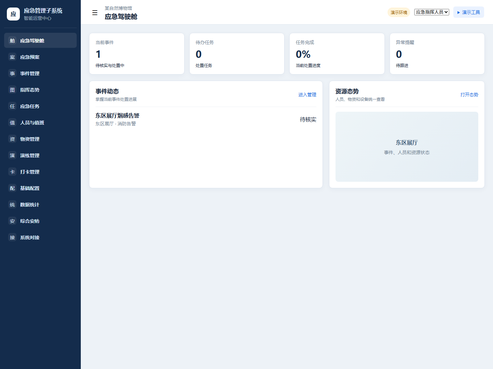
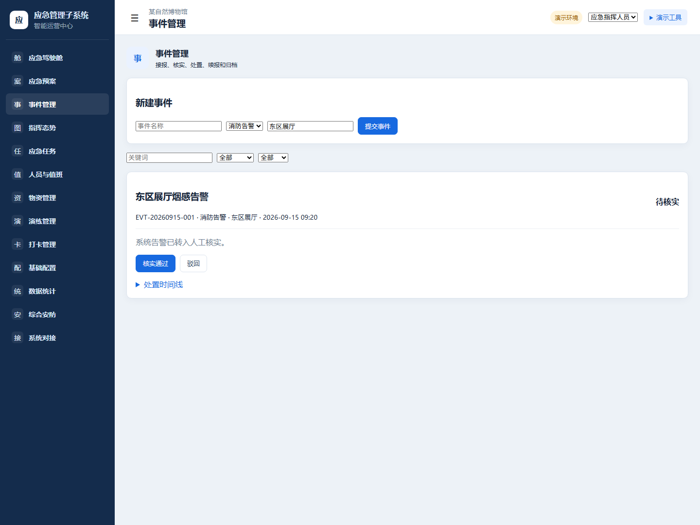
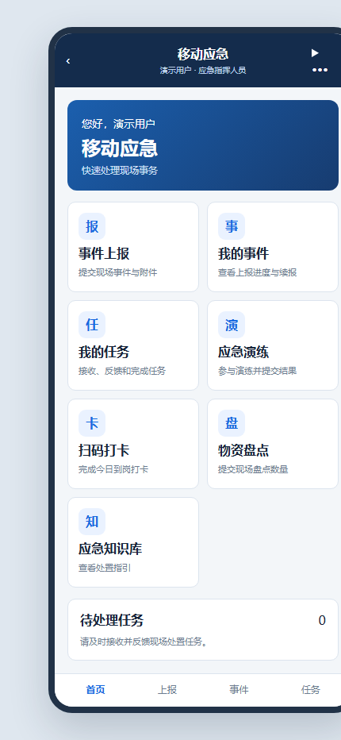
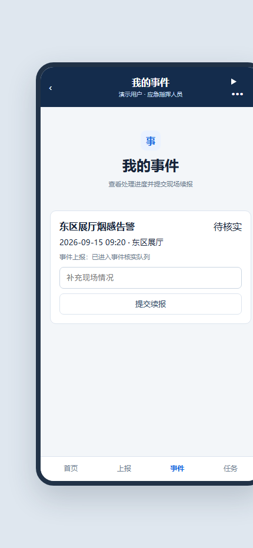
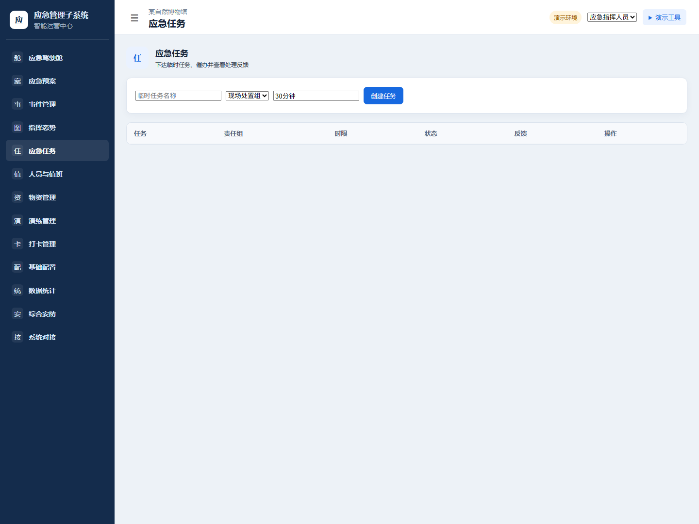
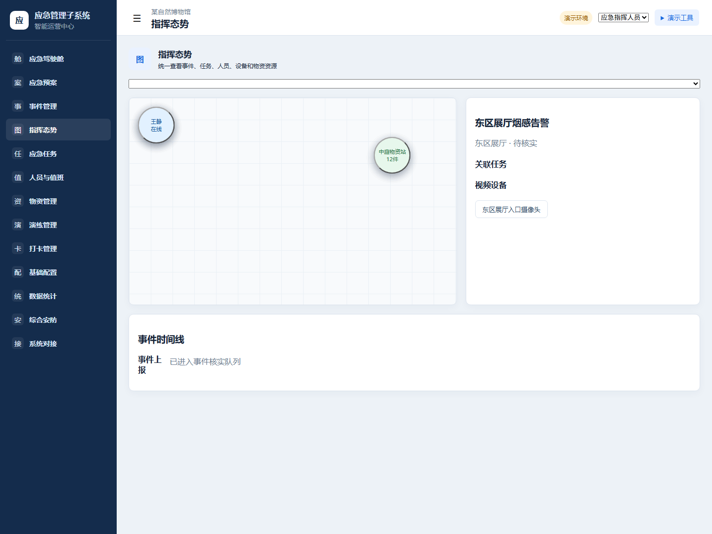
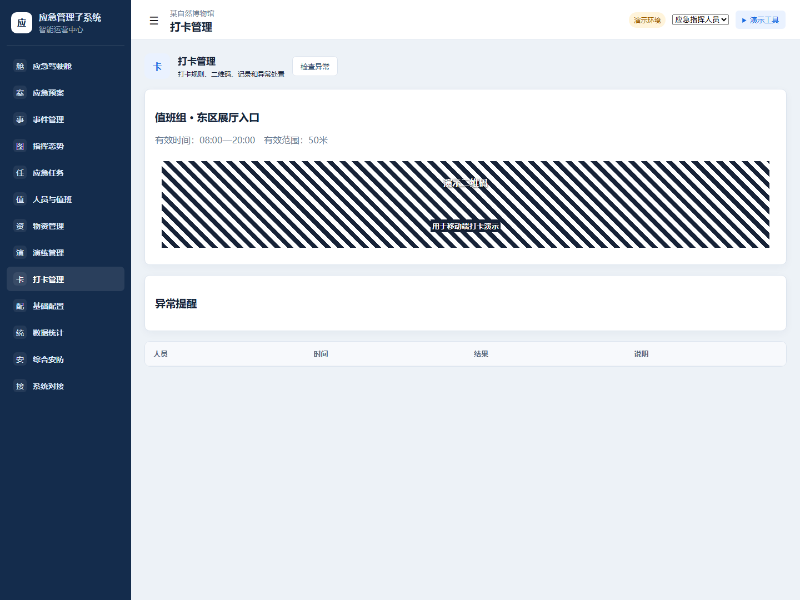

# 应急管理子系统——原型系统展示说明

## 1. 系统简介

本原型面向博物馆的应急指挥人员、值班人员、现场处置人员和物资管理员，帮助他们围绕事件接报、核实、预案启动、任务处置、资源查看和事后归档开展协同。Web 端用于管理、指挥和汇总；H5 用于现场上报、接收任务和提交结果。

当前为课程演示原型：业务数据和外部能力均为模拟，用于说明业务流程和页面交互，不代表真实外部系统已经接入或验收。

## 2. 系统整体样式

Web 采用左侧业务导航、顶部角色与演示工具、主内容区的常规管理系统布局。蓝灰色表示日常业务状态，告警和待处理信息以醒目但克制的状态提示呈现。

## 3. Web 功能总览

Web 端包括应急驾驶舱、应急预案、事件管理、指挥态势、应急任务、人员与值班、物资管理、演练管理、打卡管理、基础配置、数据统计、综合安防和系统对接。演示者可在顶部切换典型业务角色，展示不同人员的工作视角。

## 4. H5 移动端

移动端提供事件上报、我的事件、我的任务、应急演练、扫码打卡、物资盘点和应急知识库。它聚焦现场人员的操作，不承担管理端的预案发布、事件关闭或演练评估职责。

## 5. 核心演示流程

1. 选择角色后，在 Web 或 H5 上报事件；
2. Web 查看事件，核实通过后选择已发布预案；
3. 系统依据预案任务模板形成处置任务；
4. 现场人员在 H5 接收任务、提交反馈并完成任务；
5. 指挥人员在 Web 查看任务、人员、物资和事件时间线；
6. 完成评估、调查与报告材料后关闭事件。

## 6. 指挥态势

指挥态势将当前事件、关联任务、人员、设备和物资站统一呈现。点击人员、物资站或摄像头可查看简单详情。

当前地图、视频和人员定位均为原型模拟，不代表真实系统已经接入。

## 7. 演练、打卡与物资

Web 端可创建和启动演练、查看执行结果并完成评估；H5 端由参与人员确认参与并提交结果。打卡展示规则、演示二维码、记录和异常处理；物资盘点由移动端提交数量、管理端复核并更新台账。

## 8. 系统模拟范围

地图、视频、人员定位、消息、门禁、统一中台和 IoT 均使用模拟数据或状态。原型不包含真实后端、数据库、外部接口、性能测试、安全测试或生产部署；这些能力进入后续正式设计与开发阶段。
